---
output:
  pdf_document: default
  word_document: default
  html_document:
    df_print: paged
---

---
header-includes:
 \usepackage{booktabs}
 \usepackage{float}
 \usepackage{graphicx}
 \usepackage{floatrow}
 \usepackage{caption}
 \usepackage{subcaption}
 \usepackage{subfigure}
geometry:
  left=1in,right=1in,top=1in,bottom=1in
---

---
title: 'Assessment of the Yellowfin Sole Stock\ in the Bering Sea and Aleutian Islands'

#author: <h4 style="font-style:normal">"Ingrid Spies, Thomas K. Wilderbuer, Daniel G. Nichol, and James Ianelli"</h4> 
output:
  pdf_document: 
  highlight: zenburn
  html_document: default
---

\begin{centering}
\fontfamily{cmr}
\fontsize{10}{12}
  Ingrid Spies, Thomas K. Wilderbuer, Daniel G. Nichol, and James Ianelli\\
\selectfont
  Alaska Fisheries Science Center, National Marine Fisheries Service \\
  National Oceanic and Atmospheric Administration \\ 
  7600 Sand Point Way NE., Seattle, WA 98115-6349 \\
  {02 August, 2020}\\
\end{centering}

#  Executive summary

### Summary of changes in assessment inputs

Relative to last year’s BSAI SAFE report, the
following substantive changes have been made in the BSAI Yellowfin Sole assessment. 

#### Changes in the data

   1.	The 2019 NMFS eastern Bering Sea shelf bottom-trawl survey biomass estimates and standard error were included.
   2. The 2018 fishery age composition was added.
   3. The 2018 survey age composition was included.
   4. Estimates of the retained and discarded portions of the 2018 catch were added.
   5. The estimate of the total catch made through the end of 2020 was used. Catch of 150,000 t was assumed for the 2020 and 2021 projections.

### Changes in the assessment methods

Two models were considered in this assessment.

   1. The model used in the 2018 assessment, and updated with 2019 data is referred to as Model 18.1a. Model 18.1a used the same natural mortality for males and females, M=0.12. Last year's model is referred to as Model 18.1.
   
   2. A second model is presented (Model 18.2) that used a fixed value for female natural mortality (M=0.12) and allowed male natural mortality to be estimated within the model. Model 18.2 is the preferred model.

## Summary of Results

In 2019 a new model was introduced based on the 2018 Model 18.1 that retains female natural mortality fixed at 0.12 while allowing the model to estimate male natural mortality. This model is referred to as Model 18.2. Model 18.1 (and Model 18.1a) included the survey mean bottom temperature across stations < 100m as a covariate on survey catchability, as in previous years, but added survey start date as an additional covariate within the model, based on a recent study by Nichol et al. (2018). Model 18.2 retains these features.

An unexpected 32% decrease in the NMFS eastern Bering Sea survey biomass was observed in 2018. In 2019 the survey biomass was 6% higher than in 2018 at 2,006,510 t. Spawning biomass estimated by Model 18.2 remained high at 1.94 * $B_{MSY}$. Therefore, Yellowfin Sole continues to qualify for management under Tier 1a. Similar to recent years, the 1978-2013 age-1 recruitments and the corresponding spawning biomass estimates were used to fit the stock recruitment curve and determine the Tier 1 harvest recommendations. 

This assessment updates last year’s assessment with results and management quantities that are higher than the 2018 assessment. This is due to  a higher 2019 survey biomass point estimate, 6% higher than the 2018 estimate. Secondarily, the model estimated male natural mortality slightly higher than female natural mortality, 0.135, which increased biomass estimates.

Catch as of October 28, 2019 was 109,620 t. Over the past 5 years (2014 - 2018), 92.4% of the catch has taken place by this date. Therefore, the full year's estimate of catch in 2019 was 118,642 t. Future catch for the next 10 years, 2020 - 2029 was estimated as the mean of the past 10 years catch, 137,230 t.

Yellowfin Sole continue to be above $B_{MSY}$ and the annual harvest remains below the $ABC$ level. Management quantities are given in the following table for the 2018 base model (Model 18.1a) and the 2019 preferred model (Model 18.2). The projected estimate of total biomass for 2020 was higher by 17% from the 2018 assessment of 2,331,500 t, to 2,726,370 t. The model projection of spawning biomass for 2020, assuming catch for 2019 as described above, was 1,051,050 t, 132% of the projected 2020 spawning biomass from the 2018 assessment of 796,600 t. The 2020 and 2021 ABCs using $F_{ABC}$ from this assessment model were higher than the 2018 ABC of 249,100 t; 296,060 t and 296,793 t. The 2020 and 2021 OFLs estimated in this assessment were 321,794 t and 322,591 t. 

\begin{table}[ht]
\centering
\begin{tabular}{lrr|rr}
  \hline
       & \multicolumn{2}{c|}{As estimated or $\mathit{specified}$ } & \multicolumn{2}{c}{As estimated or $\mathit{recommended}$ }  \\
       & \multicolumn{2}{c|}{$\mathit{last}$ year for:}  & \multicolumn{2}{c}{$\mathit{this}$ year for: }               \\
        Quantity & 2019      &2020   & 2020      &2021 \\ 
  \hline
	M (natural mortality rate)	&	0.12	&	0.12	&	0.12, 0.135	&	0.12,0.135 \\
Tier	&	1a	&	1a	&	1a	&	1a \\
Projected total (age 6+) biomass (t)	& 2,388,000 t & 2,331,500 t &	2,726,370 t	   &	2,733,120 t  \\
Projected female spawning biomass (t) &	827,900 t	&	796,600 t	&		1,051,050 t	         &	1,005,310 t	 \\
$\:\:\:\:\:\:B_{100\%}$                                 &	1,236,000 t	&	1,236,000 t	&		1,501,510 t	       &	1,501,510 t    \\
$\:\:\:\:\:\:B_{MSY\%}$                             &	451,600 t 	&	 451,600 t	&		542,791 t	     &	542,791 t		  \\
$F_{OFL}$                             &	0.118	      &	0.118	      &		0.118	   &	0.118	\\
$maxF_{ABC}$                          & 0.107	      &	0.107	      &	  0.109	     &	0.109  	\\
$F_{ABC}$                             &	0.107       &	0.107       &		0.109           &	0.109        \\
$OFL$    	                            &	281,800 t	&	275,100 t	&	  321,794 t          &	322,591 t       \\
$maxABC$    	                        &	255,100 t	&	249,100 t	&		296,060 t      &	296,793 t   \\
$ABC$ 	                             &	255,100 t	&	249,100 t	&		296,060 t         &	296,793 t       \\
\hline
Status	                              &	2017	      &	 2018	      &		2018             &	2019          \\
\hline
Overfishing	                          &	No	        &	n/a	      &	No	                       &	n/a                 \\
Overfished	                          &	n/a	        &	No	      &	n/a	                       &	No                  \\
Approaching overfished	              &	n/a	        &	No	      &	n/a	                       &	No                  \\
\hline
\end{tabular}
\begin{tablenotes}
\item Projections were based on estimated catches of 118,642 t in 2019 and 137,230 used in place of maximum $ABC$ for 2020.
\end{tablenotes}
\end{table}

 

## Responses to SSC and Plan Team Comments on Assessments in General

_SSC December 2017_

1.The SSC reminds authors of the need to balance the desire to improve model fit with increased risk of model misspecification.

_Authors' response_

Noted.

_SSC December 2018_

1. The SSC requests that all authors fill out the risk table in 2019, and that the PTs provide comment on the author’s results in any cases where a reduction to the ABC may be warranted (concern levels 2-4).

_Authors' response_

A risk table was included in this assessent.

## Responses to SSC and Plan Team Comments Specific to this Assessment

_SSC December 2018_

1. The SSC encourages further exploration of the way mortality is handled in the model, for example through the use of sex-specific or time-varying mortality and the authors noted that they may be able to explore this more fully in 2019.

_Authors' response_

In the current assessment, a model was explored that used a fixed value for female natural mortality, and allowed male natural mortality to be estimated by within the model (Model 18.2).

2. Given recent changes in the distribution of other species, the SSC encourages authors to explore variability over time in the proportion of the stock that occurs in the Northern Bering Sea. While the model may account for this portion of the stock through the catchability parameter this assumes that the fraction of the biomass occurring in the NBS has not changed substantially. There is little evidence for a change in the NBS biomass within the area that was surveyed in all three years, but this does not account for the possibly large fraction of Yellowfin Sole in nearshore areas that were not surveyed in 2018. The SSC suggests a few avenues to explore possible changes in distribution of Yellowfin Sole, including a comparison of the full NBS survey area between 2010 and 2017, the application of the VAST model to estimate the proportion of Yellowfin Sole in the NBS over time, and an examination of other available data sources, in particular the ADF&G survey in Norton Sound that has been conducted triennially since 1978 and annually since 2017. The SSC encourages the authors to consider approaches for including the substantial biomass of NBS Yellowfin Sole in the model, with the expectations that NBS surveys will be conducted regularly in the future.

_Authors' response_

The distribution of Yellowfin Sole in the eastern Bering Sea is shown in Figure 4.1, based on results from the four most recent NBS surveys. There does not appear to be a large shift in distribution since 2010. The biomass estimate of Yellowfin Sole in the NBS in 2010 was 310,617 t (95% CI: 215,238-405,997) and it increased to 520,029 t (95% CI: 398,122-641,936) in 2019. This is compared to a survey estimate of 2,006,510 t in the eastern Bering Sea in 2019. The distribution of Yellowfin Sole will continue to be monitored and approaches for including the substantial biomass of Yellowfin Sole in the NBS will be considered in future assessments. 

# Introduction

The Yellowfin Sole (_Limanda aspera_) is one of the most abundant flatfish species in the eastern Bering Sea (EBS) and currently is the target of the largest flatfish fishery in the world.  They inhabit the EBS shelf and are considered one stock.  Abundance in the Aleutian Islands region is negligible.

Yellowfin Sole are distributed in North American waters from off British Columbia, Canada, (approx. lat. 49$^{\circ}$N) to the Chukchi Sea (about lat. 70$^{\circ}$N) and south along the Asian coast off the South Korean coast in the Sea of Japan (to about lat. 35$^{\circ}$N).  Adults exhibit a benthic lifestyle and occupy separate winter, spawning and summertime feeding distributions on the eastern Bering Sea shelf.  From over-winter grounds near the shelf margins, adults begin a migration onto the inner shelf in April or early May each year for spawning and feeding.  The directed fishery historically occurred from winter through autumn (Wilderbuer et al. 1992).  Yellowfin Sole are managed as a single stock in the BSAI management area as there is presently no direct evidence of stock structure.

# Data  

The data used in this assessment include estimates of total catch, bottom trawl survey biomass estimates and their attendant 95% confidence intervals, catch-at-age from the fishery, and population age composition estimates from the bottom trawl survey.  Weight-at-age and proportion mature-at-age are also available from studies conducted during the bottom trawl surveys.

Data source                                         Year
--------------------------------------------------- ----------------------------   
Fishery catch                                       1954 - 2019            
Fishery age composition	                            1964 - 2018          
Fishery weight-at-age	                              Avg. weight at age from 2008-2016 used for 2008-2019 
Survey biomass and standard error                   1982 - 2019 
bottom temperature	                                 1982 - 2019 
Survey age composition	                             1979 - 2018 
Annual length-at-age and weight-at-age from surveys	1979 - 2018 
Age at maturity	                                    Combined 1992 and 2012 samples
----------------------- 

_Fishery Catch and Catch-at-Age_

This assessment uses fishery catch data from 1954-2019 (Table 4.1), and fishery catch-at-age (proportions) from 1964-2018 (Table 4.2, 1975-2018).  The fishery age composition has always been primarily composed of fish older than 9 years with a large amount of 20+ fish, although the proportion has declined from 90% over age 7 to 70% over age 7 since the 1970's.

_Age Determination_

Yellowfin Sole ages have been determined at the AFSC by using the break and burn method on otoliths collected in surveys and from fisheries since 1979.  In 2016 the age determination methods for Yellowfin Sole were validated using the bomb-produced uptake measurement of 14C method (Kastelle et al. 2016).

_Length and Weight-at-Age_ 

Past assessments of Yellowfin Sole have used sex-specific, time-invariant growth based on the average length-at-age and weight-at-length relationships from the time-series of survey observations summed over all years since 1982.  These weight-at-age estimates were estimated from the von Bertalanffy growth curve.

Parameters of the von Bertalanffy growth curve have been estimated for Yellowfin Sole, by sex, from the trawl survey database as follows: 

Sex     $L_{inf}$  $K$     $t_0$     $n$
------- ---------- ------- --------- ----
Males   34.03       0.161   0.515     656
Females 38.03       0.137   0.112     709
-----------------------------------------

A sex-specific length-weight relationship was also calculated from the survey database using the power function, 
$Weight(g) =  a*Length(cm)^b$, where $a$ and $b$ are parameters estimated to provide the best fit to the data (Figure 4.2).  

Sex     $a$       $b$     $n$  
------- --------- ------- -------
Males   0.00854   3.081   2,701
Females 0.0054    3.227   3,662
---------------------------------

These estimates of weight at length were applied to the annual trawl survey estimates of population length at age, by sex, to calculate the weight at each age (Figure 4.2). Since the resulting estimates of annual weight-at-age were highly variable for fish older than 11 years, ages 11-20 were smoothed using a five-year average smoothing method for 1982-2019.

Applications of dendrochronology (tree-ring techniques) have been used to develop biochronologies from the otolith growth increments of northern rock sole (_Lepidopsetta polyxystra_), Yellowfin Sole and Alaska plaice (_Pleuronectes quadrituberculatus_) in the eastern Bering Sea. These techniques ensure that all growth increments are assigned the correct calendar year, allowing for estimation of somatic growth by age and year for chronologies that span approximately 25 years (Matta et al. 2010).  The analysis indicated that Yellowfin Sole somatic growth exhibits annual variability and has a strong positive correlation with May bottom water temperature in the Bering Sea (Figure 4.3).

The relationship between temperature and growth was further explored by reanalyzing Yellowfin Sole growth by age and year.  Length-weight data collected when obtaining otolith (age) samples in RACE surveys (n=7,000 from 1987, 1994 and 1999-2009) also indicate that weight at age exhibits annual variability and is highly correlated with summer bottom water temperature observations with a lag of 2-3 years for the temperature effect to be seen (shown for age 5 fish in Figure 4.4).  These observations were then extended back to 1979 using survey population length-at-age estimates (since weight-at-age is a power function of the length-at-age, Clark et al. 1999, Walters and Wilderbuer 2000). 

In order to incorporate time-varying (year effect on growth) and temperature-dependent growth functions into the age-structured stock assessment model we used the annual observed population mean weight-at-age (time-varying) from the trawl survey. These empirical data indicate good somatic growth correspondence with annual bottom temperature anomalies from 1982-2019 (Figure 4.4).  Fishery weight at age data awere averaged across years for each age to provide updated estimates for the fishery. 

_Maturity-at-age_

Maturity information collected from Yellowfin Sole females during the 1992 and 1993 eastern Bering Sea trawl surveys have been used in this assessment for the past 20 years (Table 4.3).  Nichol (1995) estimated the age of 50% maturity at 10.5 years based on the histological examination of 639 ovaries.  Maturity has recently been re-evaluated from a histological analysis of ovaries collected in 2012 (Table 4.3). Results were very similar to the earlier study with only a 2% difference in estimates of Yellowfin Sole female spawning biomass (TenBrink and Wilderbuer 2015).  In addition, the SSC requested that the assessment use a maturity schedule that uses estimates derived from both the 1992 and the 2012 collections (Table 4.3). For Yellowfin Sole sexual maturity occurs well after the age of entry into the fishery.  Yellowfin Sole females are 82% selected to the fishery by age 10 whereas they have been found to be only 40% mature at this age. 

## Fishery     

Yellowfin Sole have annually been caught with bottom trawls on the Bering Sea shelf since the fishery began in 1954 and were overexploited by foreign fisheries in 1959-62 when catches averaged 404,000 t annually (Figure 4.5, top panel).  As a result of reduced stock abundance, catches declined to an annual average of 117,800 t from 1963-71 and further declined to an annual average of 50,700 t from 1972-77.  The lower yield in this latter period was partially due to the discontinuation of the U.S.S.R. fishery.  In the early 1980s, after the stock condition had improved, catches again increased reaching a peak of over 227,000 t in 1985. 

During the 1980s, there was also a major transition in the characteristics of the fishery.  Yellowfin Sole were traditionally taken exclusively by foreign fisheries and these fisheries continued to dominate through 1984.  However, U.S. fisheries developed rapidly during the 1980s in the form of joint ventures, and during the last half of the decade began to dominate and then take all of the catch as the foreign fisheries were phased out of the EBS.  Since 1990, only domestic harvesting and processing has occurred.  

The management of the Yellowfin Sole fishery changed significantly in 2008 with the implementation of Amendment 80 to the BSAI Fisheries Management Plan.  The Amendment directly allocated fishery resources among BSAI trawl harvesters in consideration of their historic harvest patterns and future harvest needs in order to improve retention and utilization of fishery resources by the non-AFA trawl catcher/processor fleet.  This was accomplished by extending the groundfish retention standards to all H&G vessels and also by providing the ability to form cooperatives within the newly formed Amendment 80 sector.  In addition, Amendment 80 also mandated additional monitoring requirements which included observer coverage on all hauls, motion-compensating scales for weighing samples, flow scales to obtain accurate catch weight estimates for the entire catch, no mixing of hauls and no on-deck sorting.  The partitioning of TAC and PSC (prohibited species catch) among cooperatives has significantly changed the way the annual catch has accumulated (Fig 4.1, bottom panel) and the rate of target catch per bycatch ton. There is now a more even and slow attainment of the annual catch relative to the pre-Amendment 80 fishing behavior.  

Yellowfin Sole are usually headed and gutted, frozen at sea, and then shipped to Asian countries for further processing (AFSC 2016).  The first wholesale value of Alaska Yellowfin Sole totaled $97.8 million in 2014.  From 2016 to 2017 the first wholesale price of all Bering Sea flatfish fisheries increased 16% to $192.9 million t and Yellowfin Sole price increased 19% year over year. In 2010, following a comprehensive assessment process, the Yellowfin Sole fishery was certified under the Marine Stewardship Council environmental standard for sustainable and well-managed fisheries.  The certification also applies to all the major flatfish fisheries in the BSAI and GOA.  The total annual catch (t) since implementation of the MFCMA in 1977 is shown in Table 4.1.

In 2011, federally permitted vessels using non-pelagic trawl gear whose harvest resulted in flatfish retained catch that was greater than any other retained fishery category were required to use modified trawl gear.  The modifications required the use of elevating devices to raise the section of the trawl warps between the doors and the trawl wing tips by 2.5 inches off the seafloor.  The purpose of the management action was to reduce damage of non-target animals, particularly those that form habitat structure or support other fisheries while not substantially reducing flatfish catch rates or causing gear handling problems (Rose et al. 2010).

In 2011, federally permitted vessels using non-pelagic trawl gear whose harvest results in flatfish retained catch that is greater than any other retained fishery category were required to use modified trawl gear.  The modifications required the use of elevating devices to raise the section of the trawl warps between the doors and the trawl wing tips by 2.5 inches off the seafloor.  The purpose of the management action was to reduce damage of non-target animals, particularly those that form habitat structure or support other fisheries while not substantially reducing flatfish catch rates or causing gear handling problems (Rose et al. 2010).

The 1997 catch of 181,389 t (retained and discards) was the largest since the fishery became completely domestic, but decreased from 1998–2010, averaging 94,004 t (Table 4.4).  From 2011-2014 the catch increased, averaging 155,000 t.  The 2013 catch totaled 165,000 t (73% of the ABC), the highest annual catch in the past 19 years.  For 2019, the catch distribution has been spread out from January through May with the majority coming from four BSAI management areas (509, 513, 514, 517).  

As of mid-September 2019, the fishing season is ongoing.  In order to estimate the total 2019 catch for the stock assessment model, the average proportion of the 2011-2018 cumulative catch attained by the 35th week of the year (mid-September) was applied to the 2019 catch amount at the same time period and results in a 2019 catch estimate of 154,200 t (52.08% of the ABC).  

The size composition of the 2019 catch for both males and females, from observer sampling, are shown in Figure 4.6, the catch proportions by month and area are shown in Figure 4.7. Maps of the locations where Yellowfin Sole were caught in 2019, by month (through mid-September), are shown in Figure 4.8.  The average age of Yellowfin Sole in the 2018 catch is estimated at 13.37 and 12.83 years for females and males, respectively.

The time-series of catch in Table 4.1 also includes Yellowfin Sole that were discarded in domestic fisheries from 1987 to the present.  Annual discard estimates were calculated from at-sea sampling (Table 4.4).  The rate of discard has ranged from a low of 2% of the total catch in 2012 (and 2015) to 30% in 1992 and is estimated at 3% in the 2018 fishery.  The trend has been toward fuller retention of the catch in recent years, and with the advent of the Amendment 80 harvest practices, discarding is at its lowest level since these estimates have become available.  Historically, discarding primarily occurred in the Yellowfin Sole directed fishery, with lesser amounts in the Pacific cod, Pollock, rock sole, flathead sole, and “other flatfish” fisheries (Table 4.5).

## Survey     

_Survey Biomass Estimates and Population Age Composition Estimates_

Indices of relative abundance available from AFSC surveys showed a major increase in the abundance of Yellowfin Sole during the late 1970s, increasing from 21 kg/ha in 1975 to 51 kg/ha in 1981 (Fig. 4.2 in Bakkala and Wilderbuer 1990).  These increases have also been documented through Japanese commercial pair trawl data and catch-at-age modeling in past assessments (Bakkala and Wilderbuer 1990).

Since 1981, the survey CPUEs have fluctuated widely (Figure 4.9).  Biomass estimates for Yellowfin Sole from the annual bottom trawl survey on the eastern Bering Sea shelf are shown in Table 4.6, Table 4.7 and Figure 4.10.  The data show a doubling of survey biomass between 1975 and 1979 with a further increase to over 3.3 million t in 1981.  Total survey abundance estimates fluctuated erratically from 1983 to 1990 with biomass ranging from as high as 3.5 million t in 1983 to as low as 1.9 million t in 1986. Biomass estimates since 1990 indicate an even trend at high levels of abundance for Yellowfin Sole, with the exception of the results from the 1999 and 2000 summer surveys, which were at lower levels.  Surveys from 2001-2005 estimated an increase each year but the estimates since 2006 indicate a stable level with some annual variability.  However, the 2012 estimate is a 19% decrease from 2011 and the 2013 and 2014 surveys have estimated a 17% increase over 2012.  Similarly, there was a 24% decrease from 2014 to 2015 followed by a 48% increase from 2015 to 2016, the highest biomass estimate since 1984. Fluctuations of the magnitude shown between 1980 and 1990, 1998 and 1999, 2008 and 2009, 2011 and 2012, 2014 and 2015, and 2015 and 2016 are unreasonable considering the elements of slow growth and long life span of Yellowfin Sole combined with low to moderate exploitation rate, characteristics which should produce more gradual changes in abundance.

Variability of Yellowfin Sole survey biomass estimates (Figure 4.10) is in part due to the availability of Yellowfin Sole to the survey area (Nichol 1998).  Yellowfin Sole are known to undergo annual migrations from wintering areas off the shelf-slope break to near shore waters where they spawn throughout the spring and summer months (Nichol, 1995; Wakabayashi, 1989; Wilderbuer et al., 1992).  Exploratory survey sampling in coastal waters of the eastern Bering Sea during early summer indicate that Yellowfin Sole concentrations can be greater in these shallower areas not covered by the standard AFSC survey than in the survey proper.  Commercial bottom trawlers have commonly found high concentrations of Yellowfin Sole in areas such as near Togiak Bay (Low and Narita, 1990) and in more recent years from Kuskokwim Bay to just south of Nunivak Island.  The coastal areas are sufficiently large enough to offer a substantial refuge for Yellowfin Sole from the current survey.  

Over the past 18 years, survey biomass estimates for Yellowfin Sole have shown a positive correlation with shelf bottom temperatures (Nichol, 1998); estimates have generally been lower during cold years. The 1999 survey, which was conducted in exceptionally cold waters, indicated a decline in biomass that was unrealistic.  The bottom temperatures during the 2000 survey were much warmer than in 1999, and the biomass increased, but still did not approach estimates from earlier years.  Average bottom temperature and biomass both increased again during the period 2001 – 2003, with the 2003 value the highest temperature and biomass observed over the 22 year time series up to that time.  Given that both the 1999 and 2000 surveys were conducted two weeks earlier than previous surveys, it is possible that the time difference may also have also affected the availability of Yellowfin Sole to the survey.  If, for example, the timing of peak Yellowfin Sole spawning in nearshore waters corresponded to the time of the survey, a greater proportion of the population would be unavailable to the standard survey area.  This pattern was observed again in 2009 and 2012 when the temperatures and the bottom trawl survey point estimates were lower.  Summer shelf bottom temperatures in 2012 were the 2nd coldest recorded by the survey and the time-series and resulted in a 19% decline from 2011.  In 2016 the Bering Sea had the highest recorded bottom temperature since measurements began in 1982 and the 2016 estimate of biomass was the highest in 32 years and 48% higher than the 2015 estimate.  The 2017 survey estimate of 2,787,700 t was 3% lower than 2016, but the 2018 estimate of 1,892,925 (another warm year) was down 32% from 2017.

We propose two possible reasons why survey biomass estimates are lower during years when bottom temperatures are low.  First, catchability may be lower because Yellowfin Sole may be less active when cold.  Less active fish may be less susceptible to herding, and escapement under the footrope of survey gear may increase if fish are less active.  Secondly, bottom temperatures may influence the timing of the inshore spawning migrations of Yellowfin Sole and therefore affect their availability to the survey area (Nichol et al. in review).  Because Yellowfin Sole spawning grounds include nearshore areas outside the survey area, availability of fish within the survey area can vary with the timing of this migration and the timing of the survey.  In the case of 2016, a very warm year in the Bering Sea, it appears that a higher portion of the adult biomass was distributed on the shelf (outside of the spawning areas) relative to the average of all previous survey years, indicating earlier spawning migration (Figure 4.11).  

Yellowfin Sole population numbers-at-age estimated from the annual bottom trawl surveys are shown in Table 4.8 and their occurrence in trawl survey hauls and associated collections of lengths and age structures since 1982 are shown in Table 4.9. Their total tonnage caught in the resource assessment surveys since 1982 are listed in Table 4.10 and also in an appendix table with IPHC survey catches.

_Northern Bering Sea survey_

Trawl survey sampling was extended to the northern Bering Sea in 2010, 2017, 2018, and 2019.  The trawl surveys conducted in 2010, 2017, and 2019 occupied the same areas with similar sampling densities.  The 2018 survey was a reduced effort and only sampled a subset of the northern Bering Sea.  Stations in 2018 were 30 nautical miles apart (instead of 20 nm) and excluded Norton Sound and inshore areas north of Nunivak Island.  For comparison among years (2010, 2017, 2018), biomass estimates were derived by truncating the areal coverage of the 2010 and 2017 surveys to include only the area covered in 2018 that was common to all three surveys, and this was treated as a single stratum (Figure 4.1).   This truncated area was 158,286 square kilometers (compared to 200,207 square kilometers in 2010 and 2017).  There has been an increase in the biomass estimate of Yellowfin Sole in the northern Bering Sea since 2010; the estimate in 2010 was 310,617 t and the estimate in 2019 was 520,029 t. Since Yellowfin Sole fishing is presently prohibited in the northern Bering Sea, the biomass from this area is not included in the stock assessment model. Large shifts in the abundance of Yellowfin Sole into the Bering Sea have not been observed (Figure 4.1), but the spatial distribution will continue to be monitored as shifts may occur under future climate change.

# Analytic Approach

## General Model Structure
The abundance, mortality, recruitment and selectivity of Yellowfin Sole were assessed with a stock assessment model using the AD Model Builder language (Fournier et al. 2012; Ianelli and Fournier 1998).  The conceptual model is a separable catch-age analysis that uses survey estimates of biomass and age composition as auxiliary information (Fournier and Archibald 1982).  The assessment model simulates the dynamics of the population and compares the expected values of the population characteristics to the characteristics observed from surveys and fishery sampling programs.  This was accomplished by the simultaneous estimation of the parameters in the model using the maximum likelihood estimation procedure.  The fit of the simulated values to the observable characteristics was optimized by maximizing a log(likelihood) function given some distributional assumptions about the observed data.  

The model starts at age one and fish older than twenty are allowed to accumulate into a plus group. Since the sex-specific weight-at-age for Yellowfin Sole diverges after age of maturity (about age 10 for 40% of the stock) with females growing larger than males, the current assessment model is coded to accommodate the sex-specific aspects of the population dynamics of Yellowfin Sole.  The model allows for the input of sex-specific estimates of fishery and survey age composition and weight-at-age and provides sex-specific estimates of population numbers, fishing mortality, selectivity, fishery and survey age composition and allows for the estimation of sex-specific natural mortality and catchability.  The model retains the utility to fit combined sex data inputs.

The suite of parameters estimated by the model are classified by three likelihood components:

Data component	                           Distributional assumption
----------------------------------------- ---------------------------
Trawl fishery catch-at-age	               Multinomial
Trawl survey population age composition	  Multinomial
Trawl survey biomass estimates and S.E.	  Log-normal
----------------------------------------------------------------

The total log likelihood is the sum of the likelihoods for each data component (Table 4.11).  The likelihood components may be weighted by an emphasis factor, however, equal emphasis was placed on fitting each likelihood component in the Yellowfin Sole assessment except for the catch. The AD Model Builder software fits the data components using automatic differentiation (Griewank and Corliss 1991) software developed as a set of libraries (AUTODIFF C++ library).  

Sharp increases in trawl survey abundance estimates for most species of Bering Sea flatfish between 1981 and 1982 indicate that the 83-112 trawl was more efficient for capturing these species than the 400-mesh eastern trawl used in 1975, and 1979-81.  Allowing the model to tune to these early survey estimates would most likely underestimate the true pre-1982 biomass, thus exaggerating the degree to which biomass increased during that period.  Although this underestimate would have little effect on the estimate of current Yellowfin Sole biomass, it would affect the spawner and recruitment estimates for the time-series.  Hence, the pre-1982 survey biomass estimates were omitted from the analysis.

Total mortality $Z$ in the model was modeled as the sum of fishing mortality $F$ and natural mortality $M$, such that total mortality in year $t$ at age $a$ is $Z_{t,a}=F_{t,a}+M.$ 

Fishing mortality at each year and age, $F_{t,a}$, was the product of age-specific fishing gear selectivity $s_a$ and the median year-effect of fishing mortality ${\mu}^F$, with normally distributed error, $$F_{t,a}=s_a{{\mu}^F}e^{{\epsilon}^F_t}, {{\epsilon}^F_t}\backsim N(0,{{\sigma}_F^2}),$$ where ${\epsilon}^F_t$ is the residual year-effect of fishing mortality and ${\sigma}_F$ is the standard deviation of fishing mortality. Age-specific fishing selectivity $s_a$ was calculated using the logistic equation 

$$s_a={\displaystyle\frac{1}{1+e^{(-{\alpha}+age{\beta})}}}.$$

Catch in year $t$ for age $a$ fish $C_{t,a}$ was calculated: $$C_{t,a}={\displaystyle\frac{F_{t,a}}{Z_{t,a}}}(1-e^{Z_{t,a}})N_{t,a},$$ where $N_{t,a}$ is the number of fish at time $t$, age $a$. Total catch in each year $C_t$ was the sum of catch over all ages, $C_t={\sum_a}C_{t,a},$ and the proportion at age in catch was $P_{t,a}={\displaystyle\frac{C_{t,a}}{C_t}}.$

Recruitment from 1956-1975 was modeled as  $N_{t,1}=R_{t}=R_{0}e^{\tau_{t}}, {\tau}_t \backsim\ N(0,\sigma^2_R)$, where $R_0$ is the geometric mean of the modeled age 1 recruitment from 1956-1975, and $\sigma_{R}$ is the standard deviation of recruitment.

Recruitment from 1978-2019 was determined using the Ricker stock recruitment curve, $$R={\alpha}Se^{-{\beta}S}.$$ Parameters $\alpha$ and $\beta$ were estimated by fitting spawning biomass and recruitment during the period 1978-2013 (Figure 4.12).

The number of fish in year $t+1$ at age $a$ was the number of fish in the previous year subjected to natural and fishing mortality, $$N_{t+1,a+1}=N_{t,a}e^{-Z_{t,a}}.$$

The number of fish in a "plus group" which included all fish age 20 and older included fish surviving from age 19 as well as those age 20 and higher, $$N_{t+1,A}=N_{t,a}e^{-Z_{t,A-1}}+N_{t,A}e^{-Z_{t,A}}.$$

Spawning biomass was calculated as the product of weight at age and the number of mature females at each age, $$S_t={\sum}N_{t,a}W_{t,a}{\phi}_a,$$ where ${\phi}_a$ is the proportion of mature females at age $a$ and $W_{a,t}$ is the mean body weight in kg of fish age $a$ in year $t$. Survey biomass was assumed to be the product of catchability $q$, survey selectivity $s_a$, and the biomass, $$Biomass_{survey,t}=q{\sum}N_{t,a}W_{t,a}s_a.$$

The model of Yellowfin Sole population dynamics was evaluated with respect to the observations of the time-series of survey and fishery age compositions and the survey biomass trend since 1982. 

## Description of Alternative Models

## Parameters Estimated Outside the Assessment Model

Natural mortality ($M$) was initially estimated by a least squares analysis where catch at age data were fitted to Japanese pair trawl effort data while varying the catchability coefficient ($q$) and M simultaneously.  The best fit to the data (the point where the residual variance was minimized) occurred at a value of $M$=0.12 (Bakkala and Wespestad 1984).  This was also the value which provided the best fit to the observable population characteristics when M was profiled over a range of values in the stock assessment model using data up to 1992 (Wilderbuer 1992).  Since then, natural mortality has been estimated as a free parameter in some of the stock assessment model runs which have been evaluated the past five years.  A natural mortality value of 0.12 is used for both sexes in Model 18.1a and fixed female natural mortality at $M$=0.12 and male natural mortality estimated by the model is used in Model 18.2.

Yellowfin Sole maturity schedules were estimated from in-situ observations from two studies as discussed in a previous section (Table 4.3).

## Parameter Estimates

A list of selected parameters estimated inside the model are shown in Table 4.12.

## Parameters Estimated Inside the Assessment Model

There were 452 parameters estimated by the model. The number of key parameters are presented below:

Fishing mortality	 Selectivity	  Survey catchability	    Year-class strength         Spawner-recruit	   M    Total
------------------ ------------- ----------------------- -------------------------- ----------------------  ----- -----
67	                272	          4	                      106	                       2	                    1  452
-----------------------------------------------------------------------------------------------

The increase in the number of parameters estimated in this assessment compared to last year (7) can be accounted for by the input of another year of fishery data and the entry of another year class into the observed population, four more sex-specific fishery selectivity parameters, male natural mortality, and an additional catchability parameters.

_Year Class Strengths_

The population simulation specifies the numbers-at-age in the beginning year of the simulation, the number of recruits in each subsequent year, and the survival rate for each cohort as it moves through the population over time.

_Selectivity_

Fishery and survey selectivity was modeled separately for males and females using the two parameter formulation of the logistic function.  The model was run with an asymptotic selectivity curve for the older fish in the fishery and survey, but still was allowed to estimate the shape of the logistic curve for young fish.  The oldest year classes in the surveys and fisheries were truncated at 20 and allowed to accumulate into the age category 20+ years.  A single selectivity curve, for both males and females, was fit for all years of survey data.

Given that there have been annual changes in management, vessel participation and most likely gear selectivity, time-varying fishing selectivity curves were estimated. A logistic equation was used to model fishery selectivity and is a function of time-varying parameters specifying the age and slope at 50% selection,  $\varphi_t$ and $\eta_t$ , respectively.  The fishing selectivity ($S^f$) for age a and year t is modeled as, 

\begin{align}
S^f_{a,t}=[1+e^{\eta_t(a-\varphi_t)}]^{-1},
\end{align}

where $\varphi_t$ and $\eta_t$ are time-varying and partitioned (for estimation) into parameters representing the mean and a vector of deviations (log-scale) conditioned to sum to zero.  The deviations are constrained by a lognormal prior with a variance that was iteratively estimated.  The process of iterating was to first set the variance to a high value (diffuse prior) of $0.5^2$ and estimate the deviations.  The next step was to compare the variability of model estimates.  The variance of the model estimates were then rounded up slightly and fixed for subsequent runs.  The 2016 values were fixed as the average of the 3 most recent years. Survey selectivity curves are shown in Figure 4.13 and fishery selectiviyt in Figure 4.14

_Fishing Mortality_
The fishing mortality rates (F) for each age and year are calculated to approximate the catch weight by solving for F while still allowing for observation error in catch measurement.  A large emphasis (300) was placed on the catch likelihood component to force the model to closely match the observed catch.

_Survey Catchability_
A past assessment (Wilderbuer and Nichol 2001) first examined the relationship between estimates of survey biomass and bottom water temperature.  To better understand how water temperature may affect the catchability of Yellowfin Sole to the survey trawl, catchability was estimated for each year in the stock assessment model as:

\begin{align}
q=e^{-{\alpha}+{\beta}T},
\end{align}

where $q$ is catchability, $T$ is the average annual bottom water temperature anomaly at survey stations less than 100 m, and $\alpha$ and $\beta$ are parameters estimated by the model.  The catchability equation has two parts.  The $e^-\alpha$ term is a constant or time-independent estimate of $q$. The second term, $e^{\beta*T}$  is a time-varying (annual) $q$ which responds to metabolic aspects of herding or distribution (availability) which can vary annually with bottom water temperature.  The result of incorporating bottom temperature to estimate annual $q$ has resulted in an improved fit to the survey (described in the 2018 BSAI Yellowfin Sole assessment).  

In Model 18.1, a revised survey catchability model was introduced (in 2018), which included survey start date (expressed as deviation in days (- and +) from the average survey start date of June 4th). This feature was retained in the current model, and its interaction with annual bottom water temperature was added to the catchability equation as:

\begin{align}
q=e^{-{\alpha}+{\beta}T+{\gamma}S+{\mu}T:S},
\end{align}

where $T$=survey bottom temperature (averaged per year for all stations <100 m), $S$=survey start date, and $T:S$=interaction of $T$ and $S$.  Earlier survey start dates usually encounter colder water and since the timing of the survey start date is positively correlated with bottom water temperature, improvement in fitting the survey biomass estimates can be gained by estimating two new parameters ($\mu$ and $\gamma$).  Akaike information criterion (AIC) were used to determine if the additional variables ($S$ and $T:S$) improved the regression fit.  The improvement in fit was more than offset by the additional two parameters (Nichol et al. In review). 

_Spawner-Recruit Estimation_

Annual recruitment estimates from 1978-2013 were constrained to fit a Ricker (1958) form of the stock recruitment relationship as follows:

\begin{align}
R={\alpha}Se^{-{\beta}S},
\end{align}

where $R$ is age 1 recruitment, $S$ is female spawning biomass in metric tons the previous year, and $\alpha$ and $\beta$ are parameters estimated by the model.  The spawner-recruit fitting is estimated in a later phase after initial estimates of survival, numbers-at-age and selectivity are obtained.

# Results

## Model Evaluation

The SSC determined in December 2006 that Yellowfin Sole would be managed under the Tier 1 harvest guidelines, and therefore future harvest recommendations would be based on maximum sustainable yield $MSY$ and the associated fishing effort $F_{MSY}$ values calculated from a spawner-recruit relationship.  $MSY$ is an equilibrium concept and its value is dependent on both the spawner-recruit estimates which are assumed to represent the equilibrium stock size-recruitment relationship and the model used to fit the estimates.  In the Yellowfin Sole stock assessment model, a Ricker form of the stock-recruit relationship was fit to various combinations of these data and estimates of $F_{MSY}$ and $B_{MSY}$ were calculated, assuming that the fit to the stock-recruitment data represents the long-term productivity of the stock.  

For this assessment, two models were examined. The first was the same model used in the 2018 assessment, Model 18.1a. The second model, Model 18.2, kept female natural mortality at M=0.12 as in previous years, but allowed the model to estimate male natural mortality.

Experiments examining the bridle efficiency of the Bering Sea survey trawl indicate that Yellowfin Sole are herded into the trawl path from an area between the wing tips of the net and the point where the bridles contact the seafloor (Somerton and Munro 2001).  The herding experiments suggest that the survey trawl vulnerability (a component of catchability) is greater than 1.0.  The likelihood profile of $q$ from the model indicated a small variance with a narrow range of likely values with a low probability of $q$ being equal to the value of 1.0 in a past assessment (Wilderbuer and Nichol 2003). The trend in survey catchability was similar with Model 18.1a and Model 18.2, but the catchability was lower with Model 18.2 and estimates in some years were slightly over 1.0 (Figure 4.15). 

The sex ratio, presented as the proportion female, was estimated to be slightly lower in Model 18.1a than Model 18.2 (Figure 4.16). Overall, the total likelihod  was lower for Model 18.2, and provided a better fit to the survey and fishery ages, as well as an improvement to the fit to survey catchability (Table 4.11).

Table 4.13 indicates that the ABC values from the Model 18.2 harvest scenario for 2020 would be 35,141 t higher than Model 18.2. This is due to the higher biomass resulting from an increased value of male natural mortality in Model 18.2.  

It is important for the Tier 1 calculations to identify which subset of the stock recruitment data is used.  Using the full time series to fit the spawner recruit curve estimates that the stock is most productive at a small stock size.  Thus $MSY$ and $F_{MSY}$ are relatively high values and $B_{MSY}$ is a lower value.  If the stock was productive in the past at a small stock size because of non density-dependent factors (environment), then reducing the stock size to low levels could be detrimental to the long-term sustainability of the stock if the environment, and thus productivity, have changed from the earlier period.  Since observations of Yellowfin Sole recruitment at low stock sizes are not available from multiple time periods, it is uncertain if future recruitment events at low stock conditions would be as productive as during the late 1960s-early 1970s.

Given the uncertainty of the productivity of Yellowfin Sole at low spawning stock sizes, and because the AFSC policy for reference point time-series selection is to use the post 1977 regime shift values unless there is a compelling reason to do otherwise, the productivity of Yellowfin Sole in this assessment was estimated by fitting the 1977-2013 spawner-recruit data in the model (Figure 4.12).
  
A model that allowed $M$ to be estimated as a free parameter for males with females fixed at 0.12 provided a better fit to the sex ratio estimated from the annual trawl survey age compositions than did the base model (both sexes fixed at $M$ = 0.12).  However, since the population sex ratio annually observed at the time of the survey is a function of the timing of the annual spawning in adjacent inshore areas, it is questionable that providing the best fit to these observations is really fitting the population sex ratio better.  Thus, the model configuration which utilizes the relationship between annual seafloor temperature and survey start date to estimate survey catchability with $M$ fixed at 0.12 for both sexes (Model 18.1a) is the preferred model used to base the assessment of the condition of the Bering Sea Yellowfin Sole resource for the 2020 fishing season.

Given these results, Model 18.2 is the model of choice for estimating the Yellowfin Sole stock size and management quantities for the 2020 fishing season.  

## Time Series Results 

The data was updated in 2019 to include current values of catch, fishery and survey age compositions from 2018, and the 2019 survey biomass and standard error estimates. The fishery and survey weights-at-age were also changed in a small amount to include the latest year of data.  These changes produced Model 18.1a $ABC$ and $OFL$ estimates for 2020 similar to the 2018 assessment (Model 18.1) projections for 2019, 296,060 t and 296,793 t. Introduction of new 2019 data produced a very similar spawner-recruit curve to Model 18.0. Model 18.2 produced slightly higher estimates for ABC and OFL than Model 18.1a due to the estimate of higher male natural mortality (Table 4.13). 

The 2018 overall estimate (1982 – 2019) of trawl survey catchability decreased from Model 18.1a to Model 18.2.  This resulted in slightly higher model estimates of population numbers at age and biomass for the time-series back to 1992 relative to last year’s assessment and increased the estimated level of female spawning biomass.  The model results indicate the stock has been in a slowly declining condition since 1994 (Figure 4.10).  The five past years in the Bering Sea have had bottom temperature anomalies above the mean. The temperature-dependent $q$ adjustment for 2019 was 0.91.

_Fishing Mortality and Selectivity_

The assessment model estimates of the annual fishing mortality in terms of age-specific annual F and on fully selected ages are given in Tables 4.14 and 4.15, respectively.  The full-selection $F$ has averaged 0.07 over the period of 1978-2018 with a maximum of 0.11 in 1978 and a minimum of 0.04 in 2001.  Model estimated selectivities, Figure 4.13 and Figure 4.14 indicate that both sexes of Yellowfin Sole are 50% selected by the fishery at about age 9 and nearly fully selected by age 13, with annual variability.

_Abundance Trends_

Model 18.2 estimated $q$ at an average value of 0.79 for the period 1982-2019 which resultd in the model estimate of the 2019 age 2+ total biomass at 3,090,480 t (Table 4.6).  Model results indicate that Yellowfin Sole total biomass (age 2+) was at low levels during most of the 1960s and early 1970s (700,000-1,000,000 t) after a period of high exploitation (Table 4.6, Figure 4.17).  Sustained above average recruitment from 1967-1976 combined with light exploitation resulted in a biomass increase to a peak of 3.6 million t by 1985.  The population biomass has since been in a slow decline as the strong 1981 and 1983 year-classes have passed through the population, with only the 1991, 1995 and 2003 year-classes at levels observed during the 1970s.  The present biomass is estimated at 77% of the peak 1985 level.

The female spawning biomass has also declined since the peak in 1994, with a 2019 estimate of 1,062,990 t (Figure 4.17).  

IGNORE THIS SECTION - WORK IN PROGRESS
_The fit to the trawl survey biomass estimates are shown in Figure 4.16.  Allowing q to be correlated with annual bottom temperature and survey start date provides a better fit to the bottom trawl survey estimates than using a q fixed at the average value (Fig. 4.18).  Table 4.19 lists the numbers of female spawners estimated by the model for all ages and years. The estimated average age of Yellowfin Sole in the population is 6.5 years for males and females.

Both the trawl survey and the stock assessment model indicate that the Yellowfin Sole resource (total biomass) increased during the 1970s and early 1980s to a peak level during the mid-1980s.  The Yellowfin Sole population biomass slowly decreased over the 23 years since the mid-1990s as the majority of year-classes during those years were below average strength.  Average to above average recruitment from 2006 to 2009 is expected to maintain the abundance of Yellowfin Sole at a level above $B_{MSY}$ in the near future.  The stock assessment projection model indicates a mildly decreasing trend in female spawning biomass through 2023 if the fishing mortality rate continues at the same level as the average of the past 5 years (Fig. 4.22)._

_Recruitment Trends_

WORK IN PROGRESS
_The primary reason for the sustained increase in abundance of Yellowfin Sole during the 1970s and early 1980s was the recruitment of a series of stronger than average year classes spawned in 1967-76 (Figure 4.19 and Table 4.20).  The 1981 year class was the strongest observed (and estimated) during the 47 year period analyzed and the 1983 year class was also very strong.  Survey age composition estimates and the assessment model also estimate that the 1987 and 1988 year classes were average and the 1991 and 1995 year classes were above average.  With the exception of these 4 year classes, recruitment from 15 of the following 19 years estimated from 1984-2005 (since the strong 1983 year-class) were below the 48 year average, which caused the population to gradually decline.  The 2003 year-class has now been observed multiple times in the age compositions and is clearly a strong year class, similar to some of the strong recruitment mentioned above and have contributed to the reservoir of spawning fish in the current population.  In addition, recruitment from 2006-2009 appear also to be average to above average._

_Historical Exploitation Rates_

WORK IN PROGRESS
_Based on results from the stock assessment model, annual average exploitation rates of Yellowfin Sole since 1977 ranged from 3% to 7% of the total biomass, and have averaged 4% (Table 4.15).  Posterior distributions of selected parameters from the preferred stock assessment model used in the assessment are shown in Figure 4.20. The values and standard deviations of some selected model parameters are listed in Table 4.21._

_Retrospective Analysis_

A within-model retrospective analysis was included for the recommended assessment model (Model 18.2). In this analysis, retrospective female spawning biomass was calculated by sequentially dropping data one year at a time and then comparing the peeled estimate to the reference stock assessment model used in the assessment (Figure 4.18). Mohn's rho was -0.2185025 using this model. A similar retrospective pattern was observed as in similar yeaars, in which earlier retrospective years indicated a lower level of spawning biomass than the current year's data (Figure 4.18). The difference in female spawning biomass was negative for all years, except for the most recent, 2018 (Figure 4.19).

There is a large amount of variability in the annual survey biomass of Yellowfin Sole due to the temperature-influenced availability to the survey.  This large variability can contribute to undesirable retrospective patterns since earlier years do not fit the same highly variable information as the current year.  In particular, retrospective model runs are outside the confidence intervals of the assessment model spawning biomass trajectory for about a 17 year period from 1986-2019.   

In the 2017 assessment it was demonstrated that low values of Mohn’s rho and desirable retrospective patterns of female spawning biomass were obtainable if lower values of $M$ and $q$ were used relative to the base model.  The Plan Team and SSC requested a plot of the model-estimated female spawning biomass trajectory that reduced the retrospective pattern using $M$ fixed at 0.09 and $q$=1.0 on top of the estimated female spawning biomass trajectory with confidence interval from the assessment.  

The retrospective technique may not always be the best tool for model selection, at least for BSAI yellowfin sole as there is tension between model fit and good retrospective pattern over the range of parameterization examined.

The Plan Team recommended that the assessment continue to explore the retrospective patterns in relation to M and q by profiling over a range of combinations of M and q and recording the resulting values of Mohn’s rho and also total likelihood.  This was accomplished using data through 2018 and yielded the following results.

Profiling over $M$ and $q$ was also performed in the 2018 assessment. The best retrospective patterns did not occur at corresponding best model fit values The retrospective technique may not always be the best tool for model selection, at least for BSAI Yellowfin Sole as there is tension between model fit and good retrospective pattern over the range of parameterization examined.

# Risk assessment table

## Assessment related considerations

The BSAI Yellowfin Sole assessment is based on surveys conducted annually on the EBS shelf from 1982-2018 (no skipped years).  Fish ages, derived from otoliths collected during the surveys and the fishery to calculate annual estimates of population and fishery age composition, have been validated.  The assessment model exhibits good fits to all compositional and abundance data and converges to a single minima in the likelihood surface.  Recruitment estimates track strong year classes that are consistent with the data.  

The retrospective pattern from the current assessment model was less than desirable and has been the subject of some concern for the assessment.  Peculiar to the Yellowfin Sole assessment, in comparison to the northern rock sole and Alaska plaice assessments (that have nice patterns), is the large amount of variability in the annual survey biomass assessments for this stock due to the temperature-influenced availability to the survey.  This large variability in the annual estimates can contribute to undesirable patterns since the earlier years are not fitting the same highly variable information as the current year.  

In the 2017 assessment it was demonstrated that low values of Mohn’s rho and desirable retrospective patterns of female spawning biomass were obtainable if lower values of M and q were used relative to the base model.  However, the best retrospective patterns do not occur at the corresponding values of best overall model fit of M and q (which occur at higher levels of M and q).  The retrospective technique may not always be the best tool for model selection, at least for BSAI Yellowfin Sole as there is tension between model fit and good retrospective pattern over the range of parameterization examined.

## Population dynamics considerations

Stock assessment model results indicate that Yellowfin Sole total biomass (age 2+) was at low levels during most of the 1960s and early 1970s (700,000-1,000,000 t) after a period of high exploitation.  Sustained above average recruitment from 1967-76 combined with light exploitation resulted in a biomass increase to a peak of 3.6 million t by 1985.  The population biomass has since been in a slow decline as the strong 1981 and 1983 year-classes have passed through the population, with only the 1991, 1995 and 2003 year-classes at levels observed during the 1970s, although the 2006-2010 year-classes all look about average according to the 2018 stock assessment.  The present biomass is estimated at 78% of the peak 1985 level and is at twice the level of BMSY.  Projections indicate that the FSB will remain well-above the BMSY level through 2028.  Population dynamics are not a concern for this assessment.

## Environmental/ecosystem considerations

It is unknown how particular environmental factors affect the sustainability of Yellowfin Sole.  It has been demonstrated that the migration to spawning grounds and subsequent spawning occurs sooner in warm years.  Somatic growth has also been shown to increase in warmer temperatures. The prey field for this species consists primarily of polycheate worms and clam siphons, species whose distribution and abundance patterns relative to a changing environment are unknown. It is also unknown what effect environmental variability has on the distribution of Yellowfin Sole predators.  Given the high level of sustained abundance of this species, there is a low level of concern for a variable environment, at least for the levels observed over the past 40 years.
These results are summarized in the table below.

## Fishery performance considerations

Recent surveys of the northern Bering sea have not indicated a large shift in the spatial distribution of the eastern Bering Sea stock of Yellowfin Sole. If the stock moves northward out of the eastern Bering Sea under climate change into untrawlable areas in the northern Bering sea, then fisheries would be unable to target the stock in the untrawlable zone. A NOAA Coastal and Oceans Climate Applications proposal will be submitted examine the implications to the fishery and the region of the northern Bering Sea if the stock of Yellowfin Sole shifts northward. At the current time, fishery CPUE is not showing a contrasting pattern from the stock biomass trend, unusual spatial pattern of fishing, or changes in the percent of TAC taken, changes in the duration of fishery openings.

\begin{table}[ht]
\centering
\begin{tabular}{ p{3cm}p{3cm}p{3cm}p{3cm}p{3cm} }
\hline
 Assessment \newline consideration & Population \newline dynamics & Environmental \newline ecosystem & Fishery \newline performance & Overall \\
\hline
 Level 1: Only minor, low level of concern & Level 1: Stock trends are typical for the stock and expected given stock dynamics; recent recruitment is within the normal range. & Level 1: Stock trends are typical for the stock and expected given stock dynamics; recent recruitment is within the normal range. & Level 1: No apparent environmental/ecosystem concerns & Level 1: Normal. \\ 
\hline
\end{tabular}
\end{table}

## Harvest Recommendations

_Scenario Projections and Two-Year Ahead Overfishing Level_

In addition to the seven standard harvest scenarios, Amendments 48/48 to the BSAI and GOA Groundfish Fishery Management Plans require projections of the likely OFL two years into the future.  The 2019 numbers at age from the stock assessment model are projected to 2019 given the 2018 catch and then a 2019 catch of 150,000 t is applied to the projected 2019 population biomass to obtain the 2020 $OFL$. 

The SSC has determined that Yellowfin Sole qualify as a Tier 1 stock and therefore the 2020  $ABC$ is calculated using Tier 1 methodology. The Tier 1 harvest level is calculated as the product of the harmonic mean of $F_{MSY}$ and the geometric mean of the 2020  biomass estimate.

The geometric mean of the 2020  biomass estimate, $B_{gm}$, is estimated using the equation  $$B_{gm}=e^{ln(B)-(cv^2/2)},$$ 
where  $B$ is the point estimate of the 2020  biomass from the stock assessment model and $cv^2$ is the coefficient of variation of the point estimate (a proxy for sigma). The harmonic mean of $F_{MSY}$, $F_{har}$ is estimated as $F_{har}=e^{ln(F_{MSY}-(ln(sd^2)/2)}$, where $F_{MSY}$ is the peak mode of the $F_{MSY}$ distribution and $sd^2$ is the square of the standard deviation of the $F_{MSY}$ distribution.

In 2006 the SSC selected the 1978-2001 data set for the Tier 1 harvest recommendation.  Using this approach for the 2020 harvest (now the 1978-2013 time-series) recommendation ((Model 18.2), the $F_{ABC}$ =  $F_{harmonic_mean}$ = 0.109. The estimate of age 6+ total biomass for 2020 is 2,726,370 t. The calculations outlined above give a Tier 1 ABC harvest recommendation of 296,060 t and an $OFL$ of 321,794 t for 2020.  This results in an 8 % (25,734 t) buffer between ABC and OFL. The ABC value is % lower than last year, primarily due to the 32% decline in the survey estimate from 2018 to 2019. 

The stock assessment analysis must also consider harvest limits, usually described as overfishing fishing mortality levels with corresponding yield amounts. Amendment 56 to the BSAI FMP sets the Tier 1 harvest limit at the $F_{MSY}$ fishing mortality value.  The overfishing fishing mortality values, ABC fishing mortality values and their corresponding yields are given as follows:

Harvest level	                            F value      2020  Yield    
----------------------------------------- ------------ --------------------
Tier 1 $F_{OFL}$ = $F_{MSY}$              0.118        289,900 t         
Tier 1 $F_{ABC}$ = $F_{harmonic_mean}$    0.109        263,200 t
----------------------------------------------------------------

_Status Determination_

A standard set of projections is required for each stock managed under Tiers 1, 2, or 3 of Amendment 56.  This set of projections encompasses seven harvest scenarios designed to satisfy the requirements of Amendment 56, the National Environmental Policy Act, and the 1977 Magnuson-Stevens Fishery Conservation and Management Act (MSFCMA).

For each scenario, the projections begin with the vector of 2019 numbers at age estimated in the assessment.  This vector is then projected forward to the beginning of 2020 using the schedules of natural mortality and selectivity described in the assessment and the best available estimate of total (year-end) catch for 2019.  In each subsequent year, the fishing mortality rate is prescribed on the basis of the spawning biomass in that year and the respective harvest scenario.  In each year, recruitment is drawn from an inverse Gaussian distribution whose parameters consist of maximum likelihood estimates determined from recruitments estimated in the assessment.  Spawning biomass is computed in each year based on the time of peak spawning and the maturity and weight schedules described in the assessment.  Total catch is assumed to equal the catch associated with the respective harvest scenario in all years.  This projection scheme is run 1,000 times to obtain distributions of possible future stock sizes, fishing mortality rates, and catches.

Five of the seven standard scenarios will be used in an Environmental Assessment prepared in conjunction with the final SAFE.  These five scenarios, which are designed to provide a range of harvest alternatives that are likely to bracket the final TAC for 2020, are as follows (max $F_{ABC}$ refers to the maximum permissible value of $F_{ABC}$ under Amendment 56):

* Scenario 1:  In all future years, $F$ is set equal to max $F_{ABC}$.  (Rationale:  Historically, $TAC$ has been constrained by ABC, so this scenario provides a likely upper limit on future TACs.)
* Scenario 2:  In all future years, F is set equal to a constant fraction of max $F_{ABC}$, where this fraction is equal to the ratio of the FABC value for 2019 recommended in the assessment to the max $F_{ABC}$ for 2020.  (Rationale:  When $F_{ABC}$ is set at a value below max $F_{ABC}$, it is often set at the value recommended in the stock assessment.)
* Scenario 3:  In all future years, $F$ is set equal to the 2014-2019 average $F$.  (Rationale:  For some stocks, $TAC$ can be well below $ABC$, and recent average F may provide a better indicator of $F_{TAC}$ than $F_{ABC}$.)
* Scenario 4:  In all future years, the upper bound on $F_{ABC}$ is set at F60%. (Rationale: This scenario
provides a likely lower bound on $F_{ABC}$ that still allows future harvest rates to be adjusted
downward when stocks fall below reference levels.)
* Scenario 5:  In all future years, $F$ is set equal to zero.  (Rationale:  In extreme cases, $TAC$ may be set at a level close to zero.)

Two other scenarios are needed to satisfy the MSFCMA’s requirement to determine whether a stock is currently in an overfished condition or is approaching an overfished condition.  These two scenarios are as follow (for Tier 3 stocks, the $MSY$ level is defined as $B_{35\%}$):

* Scenario 6:  In all future years, F is set equal to $F_{OFL}$.  (Rationale:  This scenario determines whether a stock is overfished.  If the stock is expected to be above its $MSY$ level in 2016 and above its $MSY$ level in 2030 under this scenario, then the stock is not overfished.)
* Scenario 7:  In 2020 and 2021, $F$ is set equal to max $F_{ABC}$, and in all subsequent years, F is set equal to FOFL.  (Rationale:  This scenario determines whether a stock is approaching an overfished condition.  If the stock is expected to be above its $MSY$ level in 2032 under this scenario, then the stock is not approaching an overfished condition.)

Simulation results shown in Table 4.14 indicate that Yellowfin Sole are not currently overfished and are not approaching an overfished condition.  A phase plane figure of the estimated time-series of Yellowfin Sole female spawning biomass (FSB) relative to the harvest control rule is shown in Figure 4.20.

Year	 Catch	    FSB	              Geom. mean 6+ biomass	    ABC	            OFL
----- --------- ----------------- ------------------------- --------------- ---------
2020	 137,230	  1,051,050 	        2,726,370	           296,060      321,794
2021	 137,230	  1,005,310	         2,733,120	           296,793      322,591
-------------------------------------------------------------

# Ecosystem Considerations

## Ecosystem Effects on the Stock

_Prey availability/abundance trends_

Yellowfin sole diet by life stage varies as follows:  Larvae consume plankton and algae, early juveniles consume zooplankton, late juvenile stage and adults prey includes bivalves, polychaetes, amphipods, mollusks, euphausids, shrimps, brittle stars, sculpins and miscellaneous crustaceans.  Information is not available to assess the abundance trends of the benthic infauna of the Bering Sea shelf.  The original description of infaunal distribution and abundance by Haflinger (1981) resulted from sampling conducted in 1975 and 1976 and has not been re-sampled since.  The large populations of flatfish which have occupied the middle shelf of the Bering Sea over the past twenty-five years for summertime feeding do not appear food-limited.  These populations have fluctuated due to the variability in recruitment success which suggests that the primary infaunal food source has been at an adequate level to sustain the yellowfin sole resource. 

_Predator population trends_

As juveniles, it is well-documented from studies in other parts of the world that flatfish are prey for shrimp species in near shore areas.  This has not been reported for Bering Sea yellowfn sole due to a lack of juvenile sampling and collections in near shore areas, but is thought to occur.  As late juveniles they have been found in stomachs of Pacific cod and Pacific halibut; mostly small yellowfin sole ranging from 7 to 25 cm standard length..
Past, present and projected future population trends of these predator species can be found in their respective SAFE chapters in this volume and also from Annual reports compiled by the International Pacific Halibut Commission.  Encounters between yellowfin sole and their predators may be limited since their distributions do not completely overlap in space and time.

_Changes in habitat quality_

Changes in the physical environment which may affect yellowfin sole distribution patterns, recruitment success and migration timing patterns are catalogued in the Ecosystem Considerations Report of this SAFE report.  Habitat quality may be enhanced during years of favorable cross-shelf advection (juvenile survival) and warmer bottom water temperatures with reduced ice cover (higher metabolism with more active feeding).

## Fishery Effects on the Ecosystem 

1. The yellowfin sole target fishery contribution to the total bycatch of other target species is shown for 1992-2017 in Table 4.23.  The catch of non-target species from 2003-2016 is shown in Table 4.24.  The yellowfin sole target fishery contribution to the total bycatch of prohibited species is summarized for 2015 as follows:

Prohibited species 	                  Yellowfin sole fishery % of total bycatch
------------------------------------- ----------------------------------------------
Halibut mortality	                    30
Herring	                              2
Red King crab	                        5
C. bairdi	                            25.5
Other Tanner crab	                    78.2
Salmon	                               <1
------------------------------------------

2.	Relative to the predator needs in space and time, the yellowfin sole target fishery has a low selectivity for fish 7-25 cm and therefore has minimal overlap with removals from predation.

3.	The target fishery is not perceived to have an effect on the amount of large size target fish in the population due to its history of light to moderate exploitation (6%) over the past 30 years.  Population age composition data indicate a large 20+ age group.

4.	Yellowfin sole fishery discards are presented in the Catch History section.

5.	It is unknown what effect the fishery has had on yellowfin sole maturity-at-age and fecundity, but based on two maturity studies conducted 20 years apart, it is expected to be minimal.

6.	Analysis of the benthic disturbance from the yellowfin sole fishery is available in the Preliminary draft of the Essential Fish Habitat Environmental Impact Statement and summarized in Table 4.15.

# Data Gaps and Research Priorities

Genetic studies are needed to confirm the assumption that Yellowfin Sole consist of a single stock throughout the Bering Sea. Additional studies of maturity at age throughout the range of Yellowfin Sole (including the northern Bering Sea) are also warranted. 

In addition, research is needed to study the spatial variation in juvenile flatfish growth and condition in relation to habitat quality in the Bering Sea. The bottom trawl used in the Bering Sea surveys is not efficient in retaining animals of size $\leq$ 14 cm (Kotwicki et al, 2017).  In recent studies where the 83-112 bottom trawl and the 3-m plumb staff beam trawl were fished consecutively at a survey station, the catch per unit effort (CPUE, number/hectare) of juvenile yellowfin sole ($\leq$ 16 cm) estimated from the bottom trawl can be lower than the CPUE from the beam trawl by as high as an order of magnitude, or erroneously indicate absence (Yeung, unpubl. data). As a result of the low catch of small fish in the surveys, there is high uncertainty at the left tail of the age-length curve.  The age-at-length from otolith analysis of juveniles collected with the beam trawl (n=84) was consistently older by 1-3 years than the estimated age using the survey-derived age-length key (Matta and Yeung, unpubl. data), suggesting that currently the age of juveniles may have been underestimated.  Juvenile yellowfin sole are known historically to be concentrated in shallow, nearshore habitats near Kuskokwim and Togiak Bays in the EBS that are out of bottom-trawl survey range, just as the NBS surveys now showed them in high abundance in habitat of such type in Norton Sound in the NBS.  Long-term, systematic survey of the nearshore with appropriate sampling gear will improve the assessment of the density and distribution of juvenile yellowfin sole, and the understanding of the linkages between environmental drivers, habitat quality and usage, and biomass production.  Norton Sound and Kuskokwim-Togiak Bays should be focal areas of investigation for their potential importance as nurseries.  These coastal areas are of high anthropogenic and environmental sensitivity, and are experiencing anomalously high water temperatures because of climate change that are likely to impact fish growth and condition.  To fully assess yellowfin sole stock production, the level of connectivity between the EBS and NBS populations will need to be addressed with tools such as tagging, genomics, biomarkers and otolith microchemistry.

# Literature Cited

Alaska Fisheries Science Center.  2016. Wholesale market profiles for Alaska groundfish and crab fisheries.  134 p. Alaska Fish. Sci. Cent., NOAA, Natl. Mar. Fish. Serv. 7600 Sand Point Way NE. Seattle, WA.

Bakkala, R. G. and V. Wespestad.  1984.  Yellowfin sole.  In R. G. Bakkala and L. resources of the eastern Bering Sea and Aleutian Islands region in 1983, p. 37-60. U.S. Dep. Commer., NOAA Tech. Memo.  NMFS F/NWC-53.

Bakkala, R. G., V. Wespestad, and L. Low.  1982.  The yellowfin sole (Limanda aspera) resource of the eastern Bering Sea--its current and future potential for commercial fisheries.  U.S. Dep. Commer., NOAA Tech. Memo.  NMFS F/NWC-33, 43p.

Bakkala, R. G., and T. K. Wilderbuer.  1990.  Yellowfin sole.  In Stock Assessment and Fishery Evaluation Document for Groundfish Resources in the Bering Sea/Aleutian Islands     Region as Projected for 1990, p. 60-78.  North Pacific Fishery Management Council, P. O. Box 103136, Anchorage, Ak 99510.

Clark, W. G., Hare, S. R., Parms, A. M., Sullivan, P, J., Trumble, R. J.  1999.  Decadal changes in growth and recruitment of Pacific halibut (Hipplglossus stenolepis).  Can. J. fish. Aquat. Sci. 56, 242-252.

Fournier, D. A., H.G. Skaug, J. Ancheta, J. Ianelli, A. Magnusson, M. N. Maunder, A. Nielsen, and J. Sibert.  2012.  AD Model Builder: using automatic differentiation for statistical inference of highly parameterized complex nonlinear models.  Optim. Methods Softw. 27:233-239.

Fournier, D. A. and C.P. Archibald.  1982.  A general theory for analyzing catch-at-age data.  Can. J. Fish Aquat. Sci.  39:1195-1207.

Greiwank, A. and G. F. Corliss (eds) 1991.  Automatic differentiation of algorithms: theory, implementation and application.  Proceedings of the SIAM Workshop on the Automatic Differentiation of Algorithms, held Jan. 6-8, Breckenridge, CO. Soc. Indust. And Applied Mathematics, Philadelphia.

Haflinger, K.  1981.  A survey of benthic infaunal communities of the Southeastern Bering Sea shelf.  In Hood and Calder (editors) The Eastern Bering Sea Shelf: Oceanography and Resources, Vol. 2. P. 1091-1104.  Office Mar. Pol. Assess., NOAA. Univ. Wash. Press, Seattle, Wa 98105.

Ianelli, J. N. and D. A. Fournier.  1998.  Alternative age-structured analyses of the NRC simulated stock assessment data.  In Restrepo, V. R. [ed.]  Analyses of simulated data sets in support of the NRC study on stock assessment methods.  NOAA Tech. Memo.  NMFS-F/SPO-30.  96 p.

Kastelle, C., T. Helser, S. Wischniowski, T. Loher, B. Geotz and L. Kautzi.  2016. Incorporation of bomb-produced 14C into fish otoliths: A novel approach for evaluating age validation and bias with an application to yellowfin sole and northern rockfish. Ecological modeling 320 (2016) 79-91.

Kotwicki, S., Lauth, R. R., Williams, K., and Goodman, S. E. 2017. Selectivity ratio: A useful tool for comparing size selectivity of multiple survey gears. Fisheries Research, 191: 76-86.

Low, L. and R.E. Narita.  1990.  Condition of groundfish resources in the Bering Sea-Aleutian Islands region as assessed in 1988.  U.S. Dep. Commer., NOAA Tech. Memo.  NMFS-F/NWC-178, 224 p.

Matta, M. E., B. A. Black and T. K. Wilderbuer.  2010.  Climate-driven synchrony in otolith growth-increment chronologies for three Bering Sea flatfish species.  MEPS, Vol. 413:137-145, 2010.

Nichol, D. R .  1995.  Spawning and maturation of female yellowfin sole in the eastern Bering Sea.  In Proceedings of the international flatfish symposium, October 1994, Anchorage, Alaska, p. 35-50.  Univ. Alaska, Alaska Sea Grant Rep. 95-04.

Nichol, D. R.  1998.  Annual and between sex variability of yellowfin sole, Pleuronectes asper, spring-summer distributions in the eastern Bering Sea.  Fish. Bull., U.S. 96: 547-561.

Nichol, D.G., Kotwicki, S., Wilderbuer, T.K., Lauth, R.R. and Ianelli, J.N., 2019. Availability of yellowfin sole Limanda aspera to the eastern Bering Sea trawl survey and its effect on estimates of survey biomass. Fisheries Research, 211, pp.319-330.

Ricker, W. E.  1958.  Handbook of computations for biological statistics of fish populations.  Bull. Fish. Res. Bd. Can.,  (119) 300 p.

Rose, C. S., J. R. Gauvin and C. F. Hammond.  2010. Effective herding of flatfish by cables with minimal seafloor contact.  Fishery Bulletin 108(2):136-144.

Somerton, D. A. and P. Munro.  2001.  Bridle efficiency of a survey trawl for flatfish.  Fish. Bull. 99:641-652 (2001).

TenBrink, T. T. and T. K. Wilderbuer.  2015.  Updated maturity estimates for flatfishes (Pleuronectidae) in the eastern Bering Sea, with notes on histology and implications to fisheries management.  Coastal and Marine Fisheries: Dynamics, Management and Ecosystem Science. O:1-9. 2015. DOI: 10.1080/19425120.2015.1091411.

Wakabayashi, K.   1989.  Studies on the fishery biology of yellowfin sole in the eastern Bering Sea. [In Jpn., Engl. Summ.] Bull. Far Seas Fish. Res. Lab. 26:21-152.

Wakabayashi, K., R. Bakkala, and L. Low.  1977.  Status of the yellowfin sole resource in the eastern Bering Sea through    1976.  Unpubl. manuscr., 45p.  Northwest and Alaska Fish. Cent., Natl. Mar. Fish. Serv., NOAA, 7600 Sand Point Way N.E., Bin C 15700, Seattle, Wa  98115.

Walters, G. E. and T. K. Wilderbuer.  2000.  Decreasing length at age in a rapidly expanding population of northern rock sole in the eastern Bering Sea and its effect on management advice.  Journal of Sea Research 44(2000)17-26.

Wilderbuer, T. K.  1992.  Yellowfin sole.  In Stock Assessment and Fishery Evaluation Document for Groundfish Resources in the Bering Sea/Aleutian Islands     Region as Projected for 1993, chapter 3.  North Pacific Fishery Management Council, P. O. Box 103136, Anchorage, Ak 99510.

Wilderbuer, T. K.  1993.  Yellowfin sole.  In Stock Assessment and Fishery Evaluation Document for Groundfish Resources in the Bering Sea/Aleutian Islands Region as Projected for 1994, chapter 3.  North Pacific Fishery Management Council, P. O. Box 103136, Anchorage, Ak  99510.

Wilderbuer, T. K. and D. Nichol.  2001.  Yellowfin sole.  In Stock Assessment and Fishery Evaluation Document for Groundfish Resources in the Bering Sea/Aleutian Islands Region as Projected for 2004, chapter 4.  North Pacific Fishery Management Council, P. O. Box 103136, Anchorage, Ak  99510.

Wilderbuer, T. K. and D. Nichol.  2003.  Yellowfin sole.  In Stock Assessment and Fishery Evaluation Document for Groundfish Resources in the Bering Sea/Aleutian Islands Region as Projected for 2004, chapter 4.  North Pacific Fishery Management Council, P. O. Box 103136, Anchorage, Ak  99510.

Wilderbuer, T. K. D. G. Nichol, and J. Ianelli.  2010.  Yellowfin sole.  In Stock Assessment and Fishery Evaluation Document for Groundfish Resources in the Bering Sea/Aleutian Islands Region as Projected for 2011, chapter 4.  North Pacific Fishery Management Council, P. O. Box 103136, Anchorage, Ak  99510.

Wilderbuer, T.K., G.E. Walters, and R.G. Bakkala   1992.  Yellowfin sole, _Pleuronectes aspera_, of the eastern Bering Sea: biological characteristics, history of exploitation, and management.  Mar Fish. Rev. 54(4):1-18.

\pagebreak
# Tables

Table 4.1: Foreign and domestic datch (t) of Yellowfin Sole 1954-2019.  Foreign catches are designated as joint venture processing (JVP) and domestic annual processing (DAP). Catch for 2019 was downloaded October 28, 2019.

\begin{longtable}{rllll}
\toprule
\multicolumn{1}{c}{ } & \multicolumn{1}{c}{ } & \multicolumn{2}{c}{Domestic} & \multicolumn{1}{c}{ } \\
\cmidrule(l{3pt}r{3pt}){3-4}
Year & Foreign & JVP & DAP & Total\\
\midrule
1954 & 12,562 &  &  & 12,562\\
1955 & 14,690 &  &  & 14,690\\
1956 & 24,697 &  &  & 24,697\\
1957 & 24,145 &  &  & 24,145\\
1958 & 44,153 &  &  & 44,153\\
1959 & 185,321 &  &  & 185,321\\
1960 & 456,103 &  &  & 456,103\\
1961 & 553,742 &  &  & 553,742\\
1962 & 420,703 &  &  & 420,703\\
1963 & 85,810 &  &  & 85,810\\
1964 & 111,777 &  &  & 111,777\\
1965 & 53,810 &  &  & 53,810\\
1966 & 102,353 &  &  & 102,353\\
1967 & 162,228 &  &  & 162,228\\
1968 & 84,189 &  &  & 84,189\\
1969 & 167,134 &  &  & 167,134\\
1970 & 133,079 &  &  & 133,079\\
1971 & 160,399 &  &  & 160,399\\
1972 & 47,856 &  &  & 47,856\\
1973 & 78,240 &  &  & 78,240\\
1974 & 42,235 &  &  & 42,235\\
1975 & 64,690 &  &  & 64,690\\
1976 & 56,221 &  &  & 56,221\\
1977 & 58,373 &  &  & 58,373\\
1978 & 138,433 &  &  & 138,433\\
1979 & 99,019 &  &  & 99,019\\
1980 & 77,768 & 9,623 &  & 87,391\\
1981 & 81,255 & 16,046 &  & 97,301\\
1982 & 78,331 & 17,381 &  & 95,712\\
1983 & 85,874 & 22,511 &  & 108,385\\
1984 & 126,762 & 32,764 &  & 159,526\\
1985 & 100,706 & 126,401 &  & 227,107\\
1986 & 57,197 & 151,400 &  & 208,597\\
1987 & 1,811 & 179,613 & 4 & 181,428\\
1988 &  & 213,323 & 9,833 & 223,156\\
1989 &  & 151,501 & 1,664 & 153,165\\
1990 &  & 69,677 & 14,293 & 83,970\\
1991 &  &  & 115,842 & 115,842\\
1992 &  &  & 149,569 & 149,569\\
1993 &  &  & 106,101 & 106,101\\
1994 &  &  & 144,544 & 144,544\\
1995 &  &  & 124,740 & 124,740\\
1996 &  &  & 129,659 & 129,659\\
1997 &  &  & 181,389 & 181,389\\
1998 &  &  & 101,201 & 101,201\\
1999 &  &  & 67,320 & 67,320\\
2000 &  &  & 83,850 & 83,850\\
2001 &  &  & 63,395 & 63,395\\
2002 &  &  & 73,000 & 73,000\\
2003 &  &  & 74,418 & 74,418\\
2004 &  &  & 69,046 & 69,046\\
2005 &  &  & 94,383 & 94,383\\
2006 &  &  & 99,068 & 99,068\\
2007 &  &  & 121,029 & 121,029\\
2008 &  &  & 148,894 & 148,894\\
2009 &  &  & 107,528 & 107,528\\
2010 &  &  & 118,624 & 118,624\\
2011 &  &  & 151,164 & 151,164\\
2012 &  &  & 147,183 & 147,183\\
2013 &  &  & 164,944 & 164,944\\
2014 &  &  & 156,772 & 156,772\\
2015 &  &  & 126,936 & 126,936\\
2016 &  &  & 135,345 & 135,345\\
2017 &  &  & 132,265 & 132,265\\
2018 &  &  & 131,543 & 131,543\\
2019 &  &  & 109,620 & 109,620\\
\bottomrule
\end{longtable}

\pagebreak
Table 4.4: Estimates of retained and discarded (t) Yellowfin Sole caught in Bering Sea fisheries through September 25th, 2019, and the proportion discarded.

\begin{longtable}{rrrr}
\toprule
Year & Retained (mt) & Discarded (mt) & Proportion discarded\\
\midrule
1991 & 88,967 & 28,337 & 0.24\\
1992 & 102,542 & 42,843 & 0.29\\
1993 & 76,798 & 29,012 & 0.27\\
1994 & 104,918 & 35,132 & 0.25\\
1995 & 96,770 & 27,982 & 0.22\\
1996 & 101,324 & 28,335 & 0.22\\
1997 & 150,745 & 32,069 & 0.18\\
1998 & 80,267 & 20,888 & 0.21\\
1999 & 56,604 & 12,629 & 0.18\\
2000 & 69,971 & 14,100 & 0.17\\
2001 & 54,918 & 8,661 & 0.14\\
2002 & 63,625 & 11,361 & 0.15\\
2003 & 68,832 & 10,974 & 0.14\\
2004 & 62,746 & 12,765 & 0.17\\
2005 & 85,311 & 9,074 & 0.1\\
2006 & 90,592 & 8,568 & 0.09\\
2007 & 109,004 & 11,960 & 0.1\\
2008 & 141,235 & 7,659 & 0.05\\
2009 & 100,642 & 6,871 & 0.06\\
2010 & 113,244 & 5,380 & 0.05\\
2011 & 146,418 & 4,749 & 0.03\\
2012 & 142,132 & 5,055 & 0.03\\
2013 & 158,781 & 6,163 & 0.04\\
2014 & 152,167 & 4,606 & 0.03\\
2015 & 123,065 & 3,871 & 0.03\\
2016 & 131,203 & 4,143 & 0.03\\
2017 & 128,665 & 3,600 & 0.03\\
2018 & 127,331 & 4,213 & 0.03\\
2019 & 99,754 & 2,303 & 0.02\\
\bottomrule
\end{longtable}

\pagebreak
Table 4.5: Discarded and retained catch of non-CDQ Yellowfin Sole, by fishery, in 2018. Gear types include longline (HAL), bottom trawl (NPT), pot (POT), and pelagic trawl (PTR). Catch was non-zero for all target-gear combinations shown, but may appear as zero as results were rounded to the nearest metric ton (mt). Source: NMFS AKRO BLEND/Catch Accounting System.

\begin{tabular}{llll}
\toprule
  & Gear type & Discarded (mt) & Retained (mt)\\
\midrule
Greenland Turbot & HAL & 0 & 0\\
Other Species & HAL & 1 & 0\\
Pacific Cod & HAL & 1,808 & 154\\
Alaska Plaice & NPT & 0 & 0\\
Atka Mackerel & NPT & 0 & 0\\
Kamchatka Flounder & NPT & 21 & 107\\
No retained catch & NPT & 3 & 375\\
Other Species & NPT & 224 & 13,362\\
Pacific Cod & NPT & 1 & 3\\
Pollock - bottom & NPT & 0 & 0\\
Pollock - midwater & NPT & 1,606 & 108,226\\
Atka Mackerel & POT & 333 & 67\\
Yellowfin Sole & POT & 0 & 10\\
Alaska Plaice & PTR & 147 & 253\\
\bottomrule
\end{tabular}

\pagebreak
Table 4.2: Yellowfin Sole fishery catch-at-age (proportions), 1975-2018 (female), ages 7-17+.
\begin{table}[H]
\centering
\resizebox{\linewidth}{!}{
\begin{tabular}{rrrrrrrrrrrrr}
\toprule
Year & 7 & 8 & 9 & 10 & 11 & 12 & 13 & 14 & 15 & 16 & 17+ & Total proportion over age 7\\
\midrule
1975 & 0.1153 & 0.2888 & 0.2746 & 0.1200 & 0.0537 & 0.0263 & 0.0198 & 0.0230 & 0.0071 & 0.0066 & 0.0040 & 0.9392\\
1976 & 0.0976 & 0.1615 & 0.2618 & 0.2089 & 0.0916 & 0.0422 & 0.0210 & 0.0159 & 0.0185 & 0.0057 & 0.0053 & 0.9300\\
1977 & 0.1748 & 0.1957 & 0.1566 & 0.1371 & 0.0742 & 0.0273 & 0.0118 & 0.0058 & 0.0043 & 0.0050 & 0.0016 & 0.7942\\
1978 & 0.0935 & 0.2048 & 0.2280 & 0.1668 & 0.1341 & 0.0688 & 0.0245 & 0.0104 & 0.0050 & 0.0038 & 0.0044 & 0.9441\\
1979 & 0.0606 & 0.1427 & 0.2199 & 0.1942 & 0.1284 & 0.0997 & 0.0506 & 0.0180 & 0.0076 & 0.0037 & 0.0028 & 0.9282\\
1980 & 0.0621 & 0.0693 & 0.1312 & 0.1888 & 0.1705 & 0.1175 & 0.0942 & 0.0487 & 0.0175 & 0.0075 & 0.0036 & 0.9109\\
1981 & 0.0760 & 0.0983 & 0.0935 & 0.1448 & 0.1738 & 0.1379 & 0.0879 & 0.0675 & 0.0341 & 0.0121 & 0.0051 & 0.9310\\
1982 & 0.0584 & 0.1349 & 0.1356 & 0.0989 & 0.1262 & 0.1352 & 0.1012 & 0.0627 & 0.0475 & 0.0239 & 0.0085 & 0.9330\\
1983 & 0.0935 & 0.1008 & 0.1601 & 0.1250 & 0.0805 & 0.0976 & 0.1025 & 0.0761 & 0.0470 & 0.0356 & 0.0179 & 0.9366\\
1984 & 0.0349 & 0.0949 & 0.0994 & 0.1575 & 0.1235 & 0.0798 & 0.0968 & 0.1017 & 0.0756 & 0.0467 & 0.0354 & 0.9462\\
1985 & 0.0200 & 0.0565 & 0.1190 & 0.1023 & 0.1469 & 0.1110 & 0.0708 & 0.0856 & 0.0899 & 0.0667 & 0.0412 & 0.9099\\
1986 & 0.0517 & 0.0525 & 0.0986 & 0.1391 & 0.0949 & 0.1232 & 0.0894 & 0.0563 & 0.0677 & 0.0709 & 0.0526 & 0.8969\\
1987 & 0.0174 & 0.0480 & 0.0414 & 0.0831 & 0.1304 & 0.0946 & 0.1261 & 0.0925 & 0.0585 & 0.0704 & 0.0738 & 0.8362\\
1988 & 0.0497 & 0.0438 & 0.1044 & 0.0631 & 0.0910 & 0.1181 & 0.0787 & 0.1015 & 0.0736 & 0.0463 & 0.0556 & 0.8258\\
1989 & 0.0050 & 0.0784 & 0.0607 & 0.1187 & 0.0623 & 0.0847 & 0.1079 & 0.0716 & 0.0922 & 0.0668 & 0.0420 & 0.7903\\
1990 & 0.0392 & 0.0229 & 0.2241 & 0.0915 & 0.1107 & 0.0469 & 0.0596 & 0.0744 & 0.0491 & 0.0631 & 0.0457 & 0.8272\\
1991 & 0.0176 & 0.1024 & 0.0367 & 0.2407 & 0.0809 & 0.0925 & 0.0388 & 0.0492 & 0.0614 & 0.0405 & 0.0521 & 0.8128\\
1992 & 0.0158 & 0.0397 & 0.1721 & 0.0444 & 0.2317 & 0.0694 & 0.0758 & 0.0312 & 0.0393 & 0.0490 & 0.0323 & 0.8007\\
1993 & 0.0217 & 0.0249 & 0.0457 & 0.1634 & 0.0397 & 0.2093 & 0.0644 & 0.0719 & 0.0300 & 0.0381 & 0.0477 & 0.7568\\
1994 & 0.0377 & 0.0549 & 0.0559 & 0.0760 & 0.2002 & 0.0388 & 0.1776 & 0.0506 & 0.0541 & 0.0221 & 0.0278 & 0.7957\\
1995 & 0.0490 & 0.0894 & 0.0815 & 0.0587 & 0.0685 & 0.1710 & 0.0326 & 0.1485 & 0.0422 & 0.0452 & 0.0185 & 0.8051\\
1996 & 0.0257 & 0.0774 & 0.0964 & 0.0742 & 0.0516 & 0.0603 & 0.1519 & 0.0291 & 0.1330 & 0.0379 & 0.0405 & 0.7780\\
1997 & 0.0273 & 0.0372 & 0.0955 & 0.1031 & 0.0722 & 0.0478 & 0.0546 & 0.1361 & 0.0260 & 0.1184 & 0.0337 & 0.7519\\
1998 & 0.0752 & 0.0523 & 0.0562 & 0.1126 & 0.1016 & 0.0642 & 0.0403 & 0.0450 & 0.1109 & 0.0211 & 0.0958 & 0.7752\\
1999 & 0.0108 & 0.0441 & 0.0400 & 0.0531 & 0.1183 & 0.1107 & 0.0706 & 0.0444 & 0.0496 & 0.1221 & 0.0232 & 0.6869\\
2000 & 0.0097 & 0.0277 & 0.0922 & 0.0613 & 0.0604 & 0.1131 & 0.0984 & 0.0612 & 0.0382 & 0.0425 & 0.1046 & 0.7093\\
2001 & 0.0210 & 0.0421 & 0.0778 & 0.1530 & 0.0665 & 0.0521 & 0.0888 & 0.0748 & 0.0460 & 0.0286 & 0.0318 & 0.6825\\
2002 & 0.0250 & 0.0253 & 0.0506 & 0.0872 & 0.1583 & 0.0655 & 0.0502 & 0.0848 & 0.0712 & 0.0437 & 0.0272 & 0.6890\\
2003 & 0.0187 & 0.0928 & 0.0626 & 0.0769 & 0.0911 & 0.1372 & 0.0530 & 0.0396 & 0.0665 & 0.0557 & 0.0342 & 0.7283\\
2004 & 0.0182 & 0.0440 & 0.1582 & 0.0759 & 0.0743 & 0.0793 & 0.1148 & 0.0437 & 0.0326 & 0.0546 & 0.0457 & 0.7413\\
2005 & 0.0302 & 0.0401 & 0.0660 & 0.1740 & 0.0703 & 0.0642 & 0.0670 & 0.0966 & 0.0368 & 0.0274 & 0.0459 & 0.7185\\
2006 & 0.1102 & 0.0909 & 0.0700 & 0.0748 & 0.1505 & 0.0527 & 0.0450 & 0.0456 & 0.0648 & 0.0245 & 0.0182 & 0.7472\\
2007 & 0.0278 & 0.0742 & 0.0729 & 0.0663 & 0.0774 & 0.1619 & 0.0576 & 0.0495 & 0.0502 & 0.0714 & 0.0270 & 0.7362\\
2008 & 0.0418 & 0.0557 & 0.1131 & 0.0840 & 0.0638 & 0.0683 & 0.1377 & 0.0483 & 0.0412 & 0.0418 & 0.0594 & 0.7551\\
2009 & 0.0326 & 0.0762 & 0.0795 & 0.1242 & 0.0797 & 0.0571 & 0.0598 & 0.1198 & 0.0419 & 0.0358 & 0.0362 & 0.7428\\
2010 & 0.0569 & 0.0665 & 0.0955 & 0.0756 & 0.1085 & 0.0686 & 0.0491 & 0.0516 & 0.1033 & 0.0362 & 0.0309 & 0.7427\\
2011 & 0.0233 & 0.1013 & 0.0932 & 0.1051 & 0.0716 & 0.0959 & 0.0591 & 0.0419 & 0.0438 & 0.0877 & 0.0307 & 0.7536\\
2012 & 0.0291 & 0.0463 & 0.1453 & 0.1009 & 0.0972 & 0.0620 & 0.0813 & 0.0497 & 0.0351 & 0.0367 & 0.0734 & 0.7570\\
2013 & 0.0147 & 0.0338 & 0.0594 & 0.1707 & 0.1053 & 0.0947 & 0.0587 & 0.0759 & 0.0462 & 0.0326 & 0.0341 & 0.7261\\
2014 & 0.0154 & 0.0449 & 0.0702 & 0.0774 & 0.1677 & 0.0935 & 0.0817 & 0.0503 & 0.0649 & 0.0395 & 0.0279 & 0.7334\\
2015 & 0.0146 & 0.0283 & 0.0595 & 0.0722 & 0.0723 & 0.1558 & 0.0880 & 0.0776 & 0.0479 & 0.0620 & 0.0378 & 0.7160\\
2016 & 0.0337 & 0.0485 & 0.0711 & 0.1019 & 0.0855 & 0.0672 & 0.1289 & 0.0695 & 0.0603 & 0.0370 & 0.0478 & 0.7514\\
2017 & 0.0208 & 0.1146 & 0.1126 & 0.1039 & 0.1030 & 0.0700 & 0.0500 & 0.0923 & 0.0490 & 0.0423 & 0.0259 & 0.7844\\
2018 & 0.0076 & 0.0292 & 0.1376 & 0.1178 & 0.1007 & 0.0968 & 0.0652 & 0.0464 & 0.0856 & 0.0455 & 0.0392 & 0.7716\\
\bottomrule
\end{tabular}}
\end{table}

\pagebreak
Table 4.30: Yellowfin Sole biomass estimates (t) from the annual Bering Sea shelf bottom trawl survey, with upper and lower 95% confidence intervals.

\begin{tabular}{llll}
\toprule
Year & Biomass (t) & Lower confidence interval & Upper confidence interval\\
\midrule
1982 & 3,509,130 & 3,508,559 & 3,509,700\\
1983 & 3,672,420 & 3,672,015 & 3,672,824\\
1984 & 3,341,320 & 3,340,953 & 3,341,686\\
1985 & 2,398,080 & 2,397,771 & 2,398,388\\
1986 & 2,031,600 & 2,031,298 & 2,031,901\\
1987 & 2,511,840 & 2,511,457 & 2,512,222\\
1988 & 2,180,750 & 2,180,341 & 2,181,158\\
1989 & 2,313,620 & 2,313,280 & 2,313,959\\
1990 & 2,179,610 & 2,179,314 & 2,179,905\\
1991 & 2,391,860 & 2,391,585 & 2,392,134\\
1992 & 2,201,520 & 2,201,135 & 2,201,904\\
1993 & 2,468,430 & 2,468,119 & 2,468,740\\
1994 & 2,597,190 & 2,596,851 & 2,597,528\\
1995 & 2,012,400 & 2,012,117 & 2,012,682\\
1996 & 2,216,500 & 2,216,118 & 2,216,881\\
1997 & 2,161,400 & 2,161,147 & 2,161,652\\
1998 & 2,210,180 & 2,209,904 & 2,210,455\\
1999 & 1,257,180 & 1,257,000 & 1,257,359\\
2000 & 1,589,780 & 1,589,581 & 1,589,978\\
2001 & 1,679,520 & 1,679,280 & 1,679,759\\
2002 & 1,910,070 & 1,909,812 & 1,910,327\\
2003 & 2,158,130 & 2,157,723 & 2,158,536\\
2004 & 2,542,070 & 2,541,689 & 2,542,450\\
2005 & 2,820,840 & 2,820,125 & 2,821,554\\
2006 & 2,132,480 & 2,132,168 & 2,132,791\\
2007 & 2,153,090 & 2,152,712 & 2,153,467\\
2008 & 2,099,670 & 2,099,169 & 2,100,170\\
2009 & 1,739,430 & 1,739,132 & 1,739,727\\
2010 & 2,368,260 & 2,367,710 & 2,368,809\\
2011 & 2,403,220 & 2,402,743 & 2,403,696\\
2012 & 1,951,410 & 1,951,137 & 1,951,682\\
2013 & 2,279,020 & 2,278,678 & 2,279,361\\
2014 & 2,512,260 & 2,511,805 & 2,512,714\\
2015 & 1,932,350 & 1,932,064 & 1,932,635\\
2016 & 2,859,810 & 2,859,485 & 2,860,134\\
2017 & 2,787,520 & 2,787,162 & 2,787,877\\
2018 & 1,892,920 & 1,892,693 & 1,893,146\\
2019 & 2,006,510 & 2,006,096 & 2,006,923\\
\bottomrule
\end{tabular}

\pagebreak
Table 4.7: Yellowfin Sole biomass estimates (t) from the northern Bering Sea survey, with upper and lower 95% confidence intervals, as well as number of hauls, hauls with Yellowfin sole, and hauls in which length data was obtained.

\begin{tabular}{rlllrrrr}
\toprule
Year & Biomass (t) & LCI & HCI & Haul count & Hauls with catch & Number count & Length count\\
\midrule
2010 & 310,617 & 215,238 & 405,997 & 108 & 88 & 88 & 88\\
2017 & 368,156 & 254,797 & 481,515 & 110 & 98 & 98 & 97\\
2018 & 373,373 & 240,861 & 505,885 & 49 & 49 & 49 & 49\\
2019 & 520,029 & 398,122 & 641,936 & 144 & 141 & 141 & 140\\
\bottomrule
\end{tabular}
 

\pagebreak
Table 4.8: Yellowfin Sole population numbers-at-age (millions) estimated from the annual EBS bottom trawl surveys, 1982-2019. Numbers-at-age from 1982-1986 come from the standard survey area, and years 1987 forward come from the 'plusnw' extended survey area. Females are presented first, followed by males.
\begin{table}[H]
\centering
\resizebox{\linewidth}{!}{
\begin{tabular}{lrrrrrrrrrrrrrrrr}
\toprule
\multicolumn{1}{c}{Year} & \multicolumn{16}{c}{Age (Females)} \\
\cmidrule(l{3pt}r{3pt}){1-1} \cmidrule(l{3pt}r{3pt}){2-17}
  & 2 & 3 & 4 & 5 & 6 & 7 & 8 & 9 & 10 & 11 & 12 & 13 & 14 & 15 & 16 & 17+\\
\midrule
1987 & 0 & 0 & 68 & 116 & 781 & 443 & 816 & 250 & 362 & 576 & 341 & 431 & 232 & 259 & 237 & 173\\
1988 & 0 & 0 & 6 & 341 & 64 & 1,354 & 497 & 495 & 163 & 213 & 315 & 186 & 323 & 245 & 196 & 151\\
1989 & 0 & 0 & 14 & 97 & 715 & 233 & 1,333 & 592 & 446 & 74 & 179 & 307 & 234 & 238 & 183 & 82\\
1990 & 0 & 0 & 69 & 101 & 324 & 1,065 & 192 & 1,257 & 408 & 481 & 101 & 71 & 107 & 78 & 230 & 126\\
1991 & 0 & 9 & 126 & 247 & 122 & 404 & 894 & 150 & 1,261 & 212 & 524 & 62 & 127 & 86 & 122 & 163\\
1992 & 0 & 18 & 238 & 461 & 495 & 202 & 273 & 895 & 90 & 789 & 72 & 295 & 123 & 130 & 162 & 103\\
1993 & 0 & 24 & 99 & 357 & 635 & 434 & 268 & 224 & 1,315 & 78 & 867 & 156 & 165 & 68 & 67 & 91\\
1994 & 0 & 53 & 94 & 221 & 515 & 900 & 552 & 479 & 283 & 1,164 & 0 & 513 & 43 & 272 & 141 & 41\\
1995 & 0 & 18 & 152 & 288 & 181 & 890 & 628 & 275 & 135 & 24 & 634 & 20 & 561 & 104 & 80 & 96\\
1996 & 0 & 15 & 149 & 787 & 278 & 269 & 419 & 498 & 198 & 140 & 146 & 579 & 112 & 613 & 44 & 28\\
1997 & 0 & 17 & 323 & 502 & 724 & 255 & 238 & 505 & 228 & 113 & 176 & 183 & 499 & 43 & 313 & 75\\
1998 & 0 & 9 & 78 & 451 & 399 & 854 & 246 & 193 & 351 & 391 & 350 & 161 & 166 & 251 & 63 & 395\\
1999 & 0 & 3 & 61 & 188 & 166 & 177 & 699 & 100 & 103 & 236 & 183 & 179 & 69 & 98 & 169 & 101\\
2000 & 0 & 11 & 54 & 247 & 208 & 304 & 445 & 540 & 190 & 198 & 238 & 220 & 65 & 117 & 145 & 109\\
2001 & 0 & 1 & 65 & 219 & 474 & 223 & 361 & 369 & 581 & 332 & 73 & 171 & 137 & 113 & 169 & 99\\
2002 & 0 & 15 & 118 & 162 & 241 & 742 & 323 & 271 & 214 & 431 & 208 & 85 & 289 & 109 & 142 & 136\\
2003 & 0 & 15 & 113 & 234 & 241 & 276 & 1,104 & 217 & 268 & 275 & 241 & 98 & 110 & 162 & 160 & 82\\
2004 & 10 & 33 & 195 & 438 & 568 & 415 & 217 & 971 & 223 & 212 & 220 & 221 & 107 & 20 & 168 & 186\\
2005 & 0 & 52 & 166 & 194 & 584 & 412 & 230 & 471 & 873 & 220 & 136 & 183 & 334 & 163 & 50 & 180\\
2006 & 8 & 67 & 301 & 375 & 276 & 634 & 470 & 176 & 325 & 737 & 132 & 132 & 70 & 156 & 175 & 1\\
2007 & 0 & 37 & 514 & 346 & 381 & 274 & 502 & 307 & 123 & 226 & 503 & 119 & 137 & 126 & 104 & 76\\
2008 & 0 & 23 & 114 & 735 & 620 & 542 & 355 & 359 & 195 & 127 & 253 & 353 & 150 & 78 & 85 & 118\\
2009 & 5 & 37 & 203 & 203 & 1,189 & 596 & 491 & 264 & 210 & 218 & 129 & 138 & 196 & 88 & 43 & 1\\
2010 & 0 & 32 & 327 & 386 & 438 & 895 & 554 & 516 & 329 & 335 & 154 & 166 & 135 & 172 & 99 & 49\\
2011 & 0 & 14 & 243 & 539 & 706 & 463 & 769 & 410 & 456 & 204 & 226 & 148 & 141 & 144 & 186 & 98\\
2012 & 9 & 49 & 229 & 394 & 504 & 293 & 243 & 753 & 256 & 334 & 106 & 156 & 36 & 150 & 128 & 149\\
2013 & 0 & 4 & 88 & 268 & 419 & 531 & 256 & 220 & 408 & 405 & 358 & 119 & 134 & 132 & 132 & 94\\
2014 & 0 & 0 & 36 & 420 & 383 & 248 & 419 & 231 & 228 & 523 & 340 & 160 & 144 & 228 & 34 & 122\\
2015 & 0 & 22 & 3 & 167 & 466 & 349 & 307 & 287 & 249 & 149 & 282 & 258 & 134 & 99 & 80 & 67\\
2016 & 0 & 32 & 71 & 45 & 163 & 743 & 565 & 403 & 363 & 300 & 143 & 244 & 229 & 140 & 162 & 169\\
2017 & 16 & 78 & 381 & 378 & 121 & 317 & 1,001 & 481 & 335 & 377 & 228 & 148 & 202 & 200 & 148 & 117\\
2018 & 0 & 49 & 181 & 260 & 177 & 91 & 263 & 638 & 325 & 230 & 81 & 76 & 41 & 124 & 99 & 103\\
\bottomrule
\end{tabular}}
\end{table}
\begin{table}[H]
\centering
\resizebox{\linewidth}{!}{
\begin{tabular}{lrrrrrrrrrrrrrrrr}
\toprule
\multicolumn{1}{c}{Year} & \multicolumn{16}{c}{Age (Males)} \\
\cmidrule(l{3pt}r{3pt}){1-1} \cmidrule(l{3pt}r{3pt}){2-17}
  & 2 & 3 & 4 & 5 & 6 & 7 & 8 & 9 & 10 & 11 & 12 & 13 & 14 & 15 & 16 & 17+\\
\midrule
1987 & 0 & 4 & 39 & 103 & 813 & 453 & 650 & 427 & 314 & 264 & 201 & 140 & 101 & 135 & 176 & 209\\
1988 & 0 & 1 & 9 & 410 & 45 & 1,079 & 503 & 403 & 77 & 170 & 25 & 161 & 305 & 172 & 25 & 105\\
1989 & 0 & 2 & 23 & 180 & 783 & 176 & 1,301 & 511 & 355 & 134 & 49 & 103 & 53 & 203 & 35 & 38\\
1990 & 0 & 10 & 47 & 120 & 316 & 888 & 194 & 1,144 & 317 & 263 & 39 & 64 & 66 & 23 & 54 & 72\\
1991 & 0 & 0 & 102 & 353 & 139 & 274 & 1,043 & 67 & 1,135 & 328 & 243 & 74 & 64 & 60 & 52 & 91\\
1992 & 0 & 0 & 140 & 425 & 538 & 250 & 214 & 773 & 109 & 869 & 184 & 204 & 11 & 12 & 59 & 37\\
1993 & 0 & 20 & 52 & 233 & 646 & 393 & 278 & 246 & 1,096 & 69 & 842 & 52 & 53 & 50 & 0 & 48\\
1994 & 4 & 21 & 70 & 165 & 424 & 947 & 652 & 305 & 189 & 817 & 25 & 618 & 45 & 131 & 11 & 36\\
1995 & 0 & 0 & 168 & 119 & 270 & 667 & 565 & 94 & 179 & 75 & 477 & 13 & 603 & 49 & 24 & 77\\
1996 & 0 & 73 & 92 & 815 & 236 & 219 & 411 & 332 & 319 & 136 & 134 & 385 & 58 & 433 & 120 & 91\\
1997 & 0 & 9 & 214 & 425 & 797 & 180 & 183 & 445 & 245 & 194 & 213 & 108 & 514 & 78 & 264 & 30\\
1998 & 0 & 45 & 66 & 332 & 542 & 791 & 150 & 213 & 192 & 256 & 326 & 141 & 148 & 177 & 106 & 248\\
1999 & 0 & 5 & 95 & 134 & 214 & 232 & 551 & 140 & 90 & 297 & 258 & 71 & 51 & 27 & 114 & 33\\
2000 & 0 & 0 & 35 & 218 & 259 & 143 & 511 & 585 & 78 & 215 & 133 & 76 & 92 & 78 & 66 & 152\\
2001 & 0 & 0 & 80 & 129 & 598 & 307 & 339 & 321 & 509 & 189 & 79 & 143 & 59 & 66 & 128 & 54\\
2002 & 0 & 55 & 70 & 151 & 295 & 721 & 301 & 313 & 246 & 416 & 182 & 133 & 205 & 149 & 123 & 19\\
2003 & 0 & 23 & 92 & 172 & 248 & 242 & 1,038 & 229 & 351 & 51 & 275 & 167 & 9 & 69 & 55 & 103\\
2004 & 4 & 63 & 115 & 473 & 451 & 200 & 397 & 998 & 265 & 82 & 196 & 224 & 103 & 47 & 250 & 104\\
2005 & 0 & 48 & 166 & 178 & 450 & 455 & 238 & 295 & 999 & 122 & 138 & 117 & 130 & 67 & 91 & 125\\
2006 & 0 & 100 & 172 & 347 & 331 & 504 & 393 & 287 & 298 & 383 & 116 & 154 & 89 & 38 & 11 & 54\\
2007 & 0 & 57 & 480 & 351 & 405 & 283 & 545 & 209 & 165 & 266 & 334 & 99 & 131 & 69 & 59 & 122\\
2008 & 0 & 10 & 99 & 661 & 462 & 483 & 344 & 452 & 225 & 144 & 184 & 329 & 62 & 65 & 34 & 103\\
2009 & 0 & 64 & 144 & 290 & 952 & 464 & 544 & 247 & 249 & 216 & 78 & 31 & 195 & 29 & 28 & 50\\
2010 & 0 & 77 & 199 & 418 & 370 & 1,032 & 462 & 509 & 171 & 188 & 159 & 52 & 116 & 151 & 78 & 53\\
2011 & 0 & 6 & 149 & 384 & 482 & 357 & 791 & 398 & 224 & 176 & 77 & 80 & 136 & 102 & 156 & 96\\
2012 & 0 & 69 & 273 & 352 & 345 & 275 & 239 & 426 & 297 & 179 & 98 & 67 & 90 & 34 & 100 & 59\\
2013 & 0 & 6 & 91 & 365 & 383 & 481 & 210 & 267 & 444 & 199 & 200 & 33 & 88 & 99 & 117 & 18\\
2014 & 0 & 0 & 8 & 365 & 396 & 285 & 338 & 310 & 250 & 399 & 206 & 192 & 19 & 191 & 94 & 107\\
2015 & 0 & 28 & 35 & 130 & 426 & 332 & 301 & 312 & 317 & 47 & 179 & 130 & 80 & 0 & 79 & 110\\
2016 & 0 & 43 & 84 & 20 & 141 & 704 & 544 & 401 & 366 & 125 & 117 & 226 & 180 & 88 & 35 & 91\\
2017 & 9 & 120 & 231 & 396 & 106 & 260 & 880 & 498 & 310 & 275 & 194 & 107 & 215 & 155 & 37 & 12\\
2018 & 0 & 39 & 173 & 187 & 227 & 71 & 234 & 520 & 259 & 187 & 95 & 76 & 72 & 74 & 68 & 29\\
\bottomrule
\end{tabular}}
\end{table}

\pagebreak
Table 4.12: Parameter values and their 95% confidence intervals, estimated within the preferred stock assessment model, Model 18.2.
\begin{table}[H]
\centering
\resizebox{\linewidth}{!}{
\begin{tabular}{lrrrlrr}
\toprule
Name & Value & Standard Deviation & | & Name & Value & Standard Deviation\\
\midrule
male natural mortality & 1.3481e-01 & 1.3279e-03 & | & TotBiom & 2020.5 & 63.091\\
alpha (q-temp model) & -2.4340e-01 & 3.9968e-02 & | & TotBiom & 2373.0 & 72.944\\
beta (q-temp model) & 5.8060e-02 & 1.3047e-02 & | & TotBiom & 2726.0 & 82.323\\
beta (survey start date) & 1.1822e-02 & 2.9979e-03 & | & TotBiom & 3060.0 & 91.098\\
beta (start date/temp interaction) & -1.0707e-02 & 2.8686e-03 & | & TotBiom & 3250.1 & 98.348\\
mean log recruitment & 9.9301e-01 & 9.3994e-02 & | & TotBiom & 3457.6 & 104.770\\
log\_avg\_fmort & -2.4759e+00 & 7.8643e-02 & | & TotBiom & 3643.5 & 110.150\\
sel\_slope\_fsh\_f & 1.1744e+00 & 7.8338e-02 & | & TotBiom & 3772.6 & 113.190\\
sel50\_fsh\_f & 8.6199e+00 & 2.4541e-01 & | & TotBiom & 3745.4 & 113.770\\
sel\_slope\_fsh\_m & 1.4173e+00 & 9.8215e-02 & | & TotBiom & 4004.9 & 121.580\\
sel50\_fsh\_m & 8.2634e+00 & 2.2890e-01 & | & TotBiom & 4025.0 & 125.340\\
sel\_slope\_srv & 1.5478e+00 & 8.3195e-02 & | & TotBiom & 3720.0 & 121.490\\
sel50\_srv & 5.0891e+00 & 6.7953e-02 & | & TotBiom & 3697.5 & 125.040\\
sel\_slope\_srv\_m & 1.8519e-02 & 7.3259e-02 & | & TotBiom & 3591.4 & 124.510\\
sel50\_srv\_m & -2.8682e-03 & 1.6565e-02 & | & TotBiom & 3671.4 & 130.720\\
R\_logalpha & -4.4071e+00 & 4.6681e-01 & | & TotBiom & 3520.2 & 128.130\\
R\_logbeta & -6.5778e+00 & 2.8096e-01 & | & TotBiom & 3647.3 & 131.770\\
msy & 4.4874e+02 & 1.5897e+02 & | & TotBiom & 3885.9 & 139.010\\
Fmsy & 1.8969e-01 & 7.7950e-02 & | & TotBiom & 3928.9 & 142.380\\
logFmsy & -1.6624e+00 & 4.1094e-01 & | & TotBiom & 3973.9 & 143.920\\
Fmsyr & 1.1321e-01 & 3.2685e-02 & | & TotBiom & 3715.6 & 138.260\\
logFmsyr & -2.1785e+00 & 2.8870e-01 & | & TotBiom & 3619.5 & 135.810\\
Bmsy & 5.4279e+02 & 8.4647e+01 & | & TotBiom & 3646.8 & 137.800\\
Bmsyr & 3.9637e+03 & 3.7997e+02 & | & TotBiom & 3340.3 & 130.590\\
TotBiom & 2.5690e+03 & 1.6413e+02 & | & TotBiom & 3128.9 & 124.630\\
TotBiom & 2.5216e+03 & 1.4765e+02 & | & TotBiom & 3179.7 & 124.860\\
TotBiom & 2.4677e+03 & 1.2939e+02 & | & TotBiom & 3088.1 & 121.900\\
TotBiom & 2.4074e+03 & 1.0983e+02 & | & TotBiom & 3128.1 & 122.030\\
TotBiom & 2.3613e+03 & 8.9747e+01 & | & TotBiom & 3361.7 & 128.760\\
TotBiom & 2.3120e+03 & 7.0684e+01 & | & TotBiom & 3593.8 & 135.980\\
TotBiom & 2.1320e+03 & 5.4364e+01 & | & TotBiom & 3700.5 & 139.230\\
TotBiom & 1.6891e+03 & 3.9353e+01 & | & TotBiom & 3669.1 & 139.270\\
TotBiom & 1.1785e+03 & 2.6194e+01 & | & TotBiom & 3659.6 & 140.650\\
TotBiom & 8.3485e+02 & 1.6865e+01 & | & TotBiom & 3491.1 & 137.390\\
TotBiom & 8.7568e+02 & 1.7118e+01 & | & TotBiom & 3287.5 & 133.220\\
TotBiom & 8.6973e+02 & 1.7213e+01 & | & TotBiom & 3318.7 & 135.850\\
TotBiom & 9.1711e+02 & 1.8201e+01 & | & TotBiom & 3322.4 & 138.210\\
TotBiom & 9.0558e+02 & 1.9012e+01 & | & TotBiom & 3269.5 & 140.060\\
TotBiom & 8.3449e+02 & 1.9497e+01 & | & TotBiom & 3178.9 & 140.640\\
TotBiom & 8.7609e+02 & 2.1971e+01 & | & TotBiom & 2922.9 & 135.130\\
TotBiom & 8.6060e+02 & 2.4807e+01 & | & TotBiom & 2915.4 & 140.500\\
TotBiom & 9.4672e+02 & 2.9646e+01 & | & TotBiom & 3056.1 & 153.110\\
TotBiom & 1.0444e+03 & 3.5597e+01 & | & TotBiom & 2965.5 & 156.900\\
TotBiom & 1.3363e+03 & 4.3646e+01 & | & TotBiom & 3048.3 & 174.800\\
TotBiom & 1.6274e+03 & 5.2266e+01 & | & TotBiom & 3090.5 & 196.390\\
\bottomrule
\end{tabular}}
\end{table}

\pagebreak 

Table 4.11: Comparison of likelihood values for survey and fishery age, selectivity, survey biomass, recruitment, catchability, and total likelihood for Models 18.1 and 18.2.

\begin{table}[h]
\centering
\begin{tabular}{ lrr }
\hline
 Likelihood component & Model $18.1$ & Model $18.2$ \\
\hline
Survey age	        &       589.29  &  560.25   \\
Fishery age  	  &       654.46 &  609.64  \\
Selectivity     &       61.75& 62.81\\
Survey biomass     &       91.95& 95.08\\
Recruitment     &       27.07& 28.25  \\
Catchability & 0.0082 & 0.0069 \\
\hline
Total              &       1424.54      &1356.03      \\ 
\hline
\end{tabular}
\end{table}

\pagebreak

Table 4.13: Comparison of reference points with Model 18.1a and Model 18.2. Values are in metric tons (t)

\begin{table}[ht]
\centering
\begin{tabular}{lrr|rr|rr}
  \hline
       & \multicolumn{2}{c|}{Model 18.2}  & \multicolumn{2}{c}{Model 18.1a}& \multicolumn{2}{c}{Model 18.1}               \\
        Quantity & 2020      &2021   & 2020      &2021& 2020      &2021 \\ 
  \hline
$M$ (natural mortality rate)         &  0.12, 0.135   & 0.12, 0.135  &  0.12   &  0.12   &  0.12   &  0.12  \\
Tier                                  &  1a   &  1a   &  1a   & 1a &  1a   & 1a   \\
Projected total (age 6+) biomass (t)  &  2,726,370   &  2,733,120  &  2,461,850  & 2,467,300 &  2,462,400  & 2,411,700 \\
Projected female spawning biomass (t) &  1,051,050  &  1,005,310  &  857,187  & 818,117 &  850,600  & 821,500 \\
$\:\:\:\:\:\:B_{100\%}$                           &  1,501,510  &  1,501,510  &  1,274,270  & 1,274,270 &   1,261,080  & 1,261,080  \\
$\:\:\:\:\:\:B_{MSY\%}$                            &  542,791  &  542,791  &  466,029 t & 466,029 t &  1,245,400 t & 1,245,400 t\\
$F_{OFL}$                             &  0.118   &  0.118   &  0.117  & 0.117  &  0.118  & 0.118 \\
$maxF_{ABC}$                          &  0.109   &   0.109   &  0.106    & 0.106 &  0.107    & 0.107    \\
$F_{ABC}$                             &  0.109   &  0.109   &  0.106   & 0.106 &  0.107   & 0.107   \\
$OFL$                                 &  321,794  &  322,591  &  287,307  & 287,943 &  290,000  & 284,000
\\
$maxABC$                              &  296,060 &  296,793  &  260,918  & 261,497 &  263,200  & 257,800 \\
$ABC$                                 &  296,060  &  296,793 & 260,918  & 261,497 &  263,200  & 257,800 \\
\hline
Status                               & 2018       & 2019      &  2018             & 2019  &  2018             & 2019          \\
\hline
Overfishing                           & No         & n/a       & No                        & n/a     & No                        & n/a                 \\
Overfished                           & n/a         & No       & n/a                        & No         & n/a                        & No                  \\
Approaching overfished               & n/a         & No       & n/a                        & No   & n/a                        & No                  \\
\hline
\end{tabular}
\begin{tablenotes}
\item Projections were based on estimated catches of 118,642 t in 2019 and 137,230 used in place of maximum $ABC$ for 2020.
  \end{tablenotes}
\end{table}

\pagebreak
Table 4.9: Occurrence of Yellowfin Sole in the eastern Bering Sea trawl survey and collections of length and age structures and the number of otoliths aged from each survey.
\begin{table}[H]
\centering
\resizebox{\linewidth}{!}{
\begin{tabular}{rrrrrrrr}
\toprule
Year & Total hauls & Hauls with length & Number of lengths & Hauls with otoliths & Hauls with ages & Number of otoliths & Number of ages\\
\midrule
1982 & 334 & 246 & 37023 & 35 & 35 & 744 & 744\\
1983 & 353 & 256 & 33924 & 37 & 37 & 709 & 709\\
1984 & 355 & 271 & 33894 & 56 & 56 & 821 & 796\\
1985 & 357 & 261 & 33824 & 44 & 43 & 810 & 802\\
1986 & 354 & 249 & 30470 & 34 & 34 & 739 & 739\\
1987 & 357 & 224 & 31241 & 16 & 16 & 798 & 798\\
1988 & 373 & 254 & 27138 & 14 & 14 & 543 & 543\\
1989 & 374 & 236 & 29672 & 24 & 24 & 740 & 740\\
1990 & 371 & 251 & 30257 & 28 & 28 & 792 & 792\\
1991 & 372 & 248 & 27986 & 26 & 26 & 742 & 742\\
1992 & 356 & 229 & 23628 & 16 & 16 & 606 & 606\\
1993 & 375 & 242 & 26651 & 20 & 20 & 549 & 549\\
1994 & 375 & 269 & 24448 & 14 & 14 & 526 & 522\\
1995 & 376 & 254 & 22116 & 20 & 20 & 654 & 647\\
1996 & 375 & 247 & 27505 & 16 & 16 & 729 & 721\\
1997 & 376 & 262 & 26034 & 11 & 11 & 470 & 466\\
1998 & 375 & 310 & 34509 & 15 & 15 & 575 & 570\\
1999 & 373 & 276 & 28431 & 31 & 31 & 777 & 770\\
2000 & 372 & 255 & 24880 & 20 & 20 & 517 & 511\\
2001 & 375 & 251 & 26558 & 25 & 25 & 604 & 593\\
2002 & 375 & 246 & 26309 & 32 & 32 & 738 & 723\\
2003 & 376 & 241 & 27135 & 37 & 37 & 699 & 695\\
2004 & 375 & 251 & 26103 & 26 & 26 & 725 & 712\\
2005 & 373 & 251 & 24658 & 34 & 34 & 644 & 635\\
2006 & 376 & 246 & 28470 & 39 & 39 & 428 & 426\\
2007 & 376 & 247 & 24790 & 66 & 66 & 779 & 772\\
2008 & 375 & 238 & 25848 & 65 & 65 & 858 & 830\\
2009 & 376 & 235 & 22018 & 70 & 70 & 784 & 752\\
2010 & 376 & 228 & 20619 & 77 & 77 & 841 & 827\\
2011 & 376 & 228 & 21665 & 65 & 64 & 784 & 753\\
2012 & 376 & 242 & 23519 & 72 & 72 & 993 & 973\\
2013 & 376 & 232 & 23261 & 70 & 70 & 821 & 803\\
2014 & 376 & 219 & 20229 & 52 & 52 & 799 & 790\\
2015 & 376 & 223 & 20830 & 73 & 73 & 878 & 875\\
2016 & 376 & 242 & 26674 & 69 & 69 & 884 & 876\\
2017 & 376 & 258 & 25767 & 78 & 78 & 896 & 886\\
2018 & 376 & 255 & 1830 & 68 & 68 & 724 & 720\\
2019 & 376 & 270 & 25669 & 67 &  & 836 & \\
\bottomrule
\end{tabular}}
\end{table}

\pagebreak
Table 4.10: Total tonnage of Yellowfin Sole caught in resource assessment surveys in the eastern Bering Sea from 1977- 2019 .

\begin{tabular}{rr}
\toprule
Year & Research catch (t)\\
\midrule
1977 & 60\\
1978 & 71\\
1979 & 147\\
1980 & 92\\
1981 & 74\\
1982 & 158\\
1983 & 254\\
1984 & 218\\
1985 & 105\\
1986 & 68\\
1987 & 92\\
1988 & 138\\
1989 & 148\\
1990 & 129\\
1991 & 118\\
1992 & 60\\
1993 & 95\\
1994 & 91\\
1995 & 95\\
1996 & 72\\
1997 & 76\\
1998 & 79\\
1999 & 61\\
2000 & 72\\
2001 & 75\\
2002 & 76\\
2003 & 78\\
2004 & 114\\
2005 & 94\\
2006 & 74\\
2007 & 74\\
2008 & 69\\
2009 & 60\\
2010 & 79\\
2011 & 77\\
2012 & 64\\
2013 & 75\\
2014 & 81\\
2015 & 64\\
2016 & 98\\
2017 & 98\\
2018 & 67\\
2019 & 67\\
\bottomrule
\end{tabular}

\pagebreak
Table 4.6: Model estimates of Yellowfin Sole age 2+ total biomass (t) from the 2018  and  2019  stock assessments, Model 18.1a and 18.2.

\begin{longtable}{lrrrrrrr}
\toprule
\multicolumn{1}{c}{ } & \multicolumn{3}{c}{Model 18.2} & \multicolumn{3}{c}{Model 18.1a} & \multicolumn{1}{c}{Model 18.1 (for 2018)} \\
\cmidrule(l{3pt}r{3pt}){2-4} \cmidrule(l{3pt}r{3pt}){5-7} \cmidrule(l{3pt}r{3pt}){8-8}
  & Biomass (t) & LCI & HCI & Biomass (t) & LCI & HCI & Biomass (t)\\
\midrule
1954 & 2,568,990 & 2,261,130 & 2,918,770 & 2,484,650 & 2,201,400 & 2,804,350 & 2,484,660\\
1955 & 2,521,590 & 2,243,160 & 2,834,590 & 2,451,510 & 2,195,400 & 2,737,500 & 2,451,520\\
1956 & 2,467,720 & 2,222,200 & 2,740,360 & 2,408,740 & 2,182,800 & 2,658,060 & 2,408,730\\
1957 & 2,407,370 & 2,197,530 & 2,637,240 & 2,356,300 & 2,162,490 & 2,567,480 & 2,356,260\\
1958 & 2,361,270 & 2,188,490 & 2,547,690 & 2,315,220 & 2,154,130 & 2,488,340 & 2,315,130\\
1959 & 2,312,040 & 2,174,940 & 2,457,780 & 2,268,910 & 2,138,960 & 2,406,760 & 2,268,770\\
1960 & 2,131,950 & 2,025,970 & 2,243,480 & 2,090,600 & 1,988,100 & 2,198,380 & 2,090,420\\
1961 & 1,689,120 & 1,612,230 & 1,769,680 & 1,649,190 & 1,574,230 & 1,727,710 & 1,649,020\\
1962 & 1,178,470 & 1,127,240 & 1,232,040 & 1,140,420 & 1,092,000 & 1,190,990 & 1,140,340\\
1963 & 834,849 & 801,795 & 869,266 & 801,564 & 769,753 & 834,689 & 801,374\\
1964 & 875,678 & 842,106 & 910,590 & 843,483 & 811,145 & 877,109 & 843,239\\
1965 & 869,728 & 835,979 & 904,840 & 838,642 & 806,422 & 872,150 & 838,326\\
1966 & 917,105 & 881,419 & 954,236 & 887,269 & 853,296 & 922,594 & 886,834\\
1967 & 905,579 & 868,346 & 944,408 & 876,554 & 841,448 & 913,124 & 875,924\\
1968 & 834,485 & 796,394 & 874,398 & 803,736 & 768,711 & 840,357 & 802,782\\
1969 & 876,087 & 833,236 & 921,142 & 838,578 & 800,074 & 878,935 & 837,091\\
1970 & 860,596 & 812,394 & 911,658 & 811,896 & 770,312 & 855,724 & 809,476\\
1971 & 946,723 & 889,263 & 1,007,900 & 876,630 & 828,711 & 927,320 & 872,868\\
1972 & 1,044,350 & 975,549 & 1,118,010 & 948,363 & 892,483 & 1,007,740 & 942,763\\
1973 & 1,336,300 & 1,251,820 & 1,426,480 & 1,203,680 & 1,136,150 & 1,275,230 & 1,195,830\\
1974 & 1,627,450 & 1,526,230 & 1,735,380 & 1,455,070 & 1,374,890 & 1,539,920 & 1,444,640\\
1975 & 2,020,490 & 1,898,200 & 2,150,660 & 1,816,730 & 1,720,400 & 1,918,450 & 1,803,120\\
1976 & 2,372,970 & 2,231,510 & 2,523,400 & 2,129,020 & 2,018,310 & 2,245,810 & 2,112,310\\
1977 & 2,726,000 & 2,566,260 & 2,895,680 & 2,445,170 & 2,320,640 & 2,576,390 & 2,425,340\\
1978 & 3,060,000 & 2,883,160 & 3,247,680 & 2,746,130 & 2,608,640 & 2,890,860 & 2,723,240\\
1979 & 3,250,100 & 3,059,280 & 3,452,820 & 2,911,620 & 2,763,470 & 3,067,710 & 2,885,990\\
1980 & 3,457,650 & 3,254,370 & 3,673,620 & 3,099,080 & 2,941,260 & 3,265,380 & 3,070,950\\
1981 & 3,643,470 & 3,429,750 & 3,870,510 & 3,270,070 & 3,104,010 & 3,445,020 & 3,239,750\\
1982 & 3,772,620 & 3,552,940 & 4,005,880 & 3,387,390 & 3,217,250 & 3,566,520 & 3,355,420\\
1983 & 3,745,370 & 3,524,650 & 3,979,910 & 3,366,060 & 3,194,630 & 3,546,700 & 3,333,580\\
1984 & 4,004,910 & 3,769,040 & 4,255,550 & 3,597,530 & 3,414,920 & 3,789,910 & 3,562,120\\
1985 & 4,025,010 & 3,782,030 & 4,283,600 & 3,610,280 & 3,421,950 & 3,808,990 & 3,573,460\\
1986 & 3,720,010 & 3,484,860 & 3,971,040 & 3,322,840 & 3,140,450 & 3,515,820 & 3,286,830\\
1987 & 3,697,540 & 3,455,790 & 3,956,200 & 3,286,430 & 3,099,550 & 3,484,570 & 3,249,150\\
1988 & 3,591,380 & 3,350,870 & 3,849,150 & 3,191,390 & 3,004,670 & 3,389,720 & 3,153,670\\
1989 & 3,671,410 & 3,419,140 & 3,942,300 & 3,253,770 & 3,057,930 & 3,462,160 & 3,213,350\\
1990 & 3,520,210 & 3,273,140 & 3,785,940 & 3,118,970 & 2,926,450 & 3,324,160 & 3,078,880\\
1991 & 3,647,290 & 3,393,130 & 3,920,500 & 3,241,290 & 3,042,490 & 3,453,090 & 3,199,350\\
1992 & 3,885,910 & 3,617,680 & 4,174,040 & 3,454,780 & 3,245,120 & 3,677,980 & 3,409,630\\
1993 & 3,928,940 & 3,654,340 & 4,224,170 & 3,492,620 & 3,277,510 & 3,721,850 & 3,445,060\\
1994 & 3,973,900 & 3,696,330 & 4,272,320 & 3,538,370 & 3,320,230 & 3,770,840 & 3,488,610\\
1995 & 3,715,600 & 3,449,220 & 4,002,560 & 3,308,440 & 3,097,970 & 3,533,200 & 3,260,090\\
1996 & 3,619,500 & 3,357,900 & 3,901,480 & 3,225,530 & 3,018,160 & 3,447,150 & 3,176,270\\
1997 & 3,646,800 & 3,381,440 & 3,932,970 & 3,244,380 & 3,034,120 & 3,469,200 & 3,192,500\\
1998 & 3,340,330 & 3,089,200 & 3,611,880 & 2,966,150 & 2,766,510 & 3,180,190 & 2,915,720\\
1999 & 3,128,930 & 2,889,430 & 3,388,280 & 2,777,970 & 2,586,890 & 2,983,160 & 2,729,090\\
2000 & 3,179,720 & 2,939,640 & 3,439,410 & 2,828,020 & 2,636,370 & 3,033,600 & 2,777,110\\
2001 & 3,088,090 & 2,853,750 & 3,341,670 & 2,751,650 & 2,563,780 & 2,953,300 & 2,700,600\\
2002 & 3,128,070 & 2,893,370 & 3,381,810 & 2,793,390 & 2,604,940 & 2,995,480 & 2,740,550\\
2003 & 3,361,730 & 3,113,910 & 3,629,280 & 3,010,240 & 2,810,900 & 3,223,720 & 2,952,120\\
2004 & 3,593,780 & 3,331,950 & 3,876,180 & 3,222,040 & 3,011,350 & 3,447,470 & 3,159,430\\
2005 & 3,700,510 & 3,432,350 & 3,989,610 & 3,326,660 & 3,110,140 & 3,558,270 & 3,262,810\\
2006 & 3,669,130 & 3,400,990 & 3,958,400 & 3,299,880 & 3,082,940 & 3,532,100 & 3,237,110\\
2007 & 3,659,630 & 3,388,970 & 3,951,900 & 3,295,220 & 3,075,390 & 3,530,760 & 3,235,570\\
2008 & 3,491,070 & 3,226,920 & 3,776,840 & 3,144,840 & 2,929,280 & 3,376,270 & 3,090,920\\
2009 & 3,287,460 & 3,031,620 & 3,564,880 & 2,961,960 & 2,752,230 & 3,187,670 & 2,911,530\\
2010 & 3,318,660 & 3,057,880 & 3,601,680 & 2,991,290 & 2,777,050 & 3,222,060 & 2,952,490\\
2011 & 3,322,390 & 3,057,270 & 3,610,500 & 2,997,540 & 2,778,850 & 3,233,450 & 2,964,970\\
2012 & 3,269,470 & 3,001,140 & 3,561,790 & 2,946,940 & 2,724,920 & 3,187,050 & 2,927,370\\
2013 & 3,178,900 & 2,909,820 & 3,472,860 & 2,862,240 & 2,638,810 & 3,104,590 & 2,856,100\\
2014 & 2,922,880 & 2,664,870 & 3,205,860 & 2,637,930 & 2,421,650 & 2,873,530 & 2,644,760\\
2015 & 2,915,360 & 2,647,620 & 3,210,180 & 2,630,700 & 2,404,780 & 2,877,840 & 2,648,330\\
2016 & 3,056,080 & 2,764,880 & 3,377,950 & 2,754,150 & 2,507,330 & 3,025,270 & 2,809,140\\
2017 & 2,965,470 & 2,667,900 & 3,296,230 & 2,672,270 & 2,418,270 & 2,952,950 & 2,735,330\\
2018 & 3,048,260 & 2,718,210 & 3,418,380 & 2,748,760 & 2,464,340 & 3,066,000 & 2,783,240\\
2019 & 3,090,480 & 2,721,980 & 3,508,860 & 2,786,330 & 2,465,790 & 3,148,540 & -\\
\bottomrule
\end{longtable}

\pagebreak
Table 4.31: Model estimates of Yellowfin Sole female spawning biomass (t) from the 2018  and  2019  stock assessments, including Model 18.1a and 18.2.

\begin{longtable}{lrrrrrrl}
\toprule
\multicolumn{1}{c}{ } & \multicolumn{3}{c}{Model 18.2} & \multicolumn{3}{c}{Model 18.1a} & \multicolumn{1}{c}{Model 18.1 (for 2018)} \\
\cmidrule(l{3pt}r{3pt}){2-4} \cmidrule(l{3pt}r{3pt}){5-7} \cmidrule(l{3pt}r{3pt}){8-8}
  & Biomass (t) & LCI & HCI & Biomass (t) & LCI & HCI & Biomass (t)\\
\midrule
1954 & 995,657.0 & 769,574.00 & 1,288,160.0 & 965,158.0 & 745,362.00 & 1,249,770.0 & 965,180\\
1955 & 1,005,490.0 & 789,513.00 & 1,280,540.0 & 974,459.0 & 764,562.00 & 1,241,980.0 & 974,478\\
1956 & 996,743.0 & 794,331.00 & 1,250,730.0 & 965,754.0 & 769,136.00 & 1,212,630.0 & 965,769\\
1957 & 972,387.0 & 785,412.00 & 1,203,870.0 & 941,927.0 & 760,439.00 & 1,166,730.0 & 941,937\\
1958 & 935,656.0 & 764,916.00 & 1,144,510.0 & 906,162.0 & 740,604.00 & 1,108,730.0 & 906,164\\
1959 & 859,116.0 & 708,274.00 & 1,042,080.0 & 832,051.0 & 686,208.00 & 1,008,890.0 & 832,024\\
1960 & 672,609.0 & 551,965.00 & 819,622.0 & 652,714.0 & 537,574.00 & 792,514.0 & 652,602\\
1961 & 369,438.0 & 283,114.00 & 482,084.0 & 361,924.0 & 283,306.00 & 462,360.0 & 361,684\\
1962 & 47,947.1 & 19,142.30 & 120,097.0 & 45,709.5 & 18,365.00 & 113,769.0 & 45,744\\
1963 & 12,713.5 & 4,771.03 & 33,878.1 & 11,860.3 & 4,369.86 & 32,190.3 & 11,903\\
1964 & 26,217.9 & 13,231.70 & 51,949.6 & 24,620.4 & 12,209.80 & 49,645.8 & 24,680\\
1965 & 51,390.6 & 32,678.90 & 80,816.3 & 48,391.8 & 30,381.90 & 77,077.5 & 48,467\\
1966 & 91,133.0 & 67,412.60 & 123,200.0 & 86,020.9 & 63,017.30 & 117,422.0 & 86,091\\
1967 & 125,614.0 & 101,748.00 & 155,079.0 & 118,571.0 & 95,251.90 & 147,600.0 & 118,615\\
1968 & 147,229.0 & 123,776.00 & 175,127.0 & 139,155.0 & 116,191.00 & 166,658.0 & 139,235\\
1969 & 152,238.0 & 125,818.00 & 184,205.0 & 143,969.0 & 118,341.00 & 175,145.0 & 144,077\\
1970 & 119,798.0 & 101,361.00 & 141,589.0 & 113,134.0 & 96,019.80 & 133,298.0 & 113,084\\
1971 & 94,236.3 & 79,962.60 & 111,058.0 & 97,695.7 & 84,577.10 & 112,849.0 & 97,519\\
1972 & 65,769.8 & 52,544.50 & 82,323.8 & 80,097.9 & 67,835.60 & 94,576.8 & 79,795\\
1973 & 70,963.1 & 57,242.70 & 87,972.3 & 81,619.6 & 68,409.30 & 97,380.8 & 81,181\\
1974 & 85,064.4 & 70,287.10 & 102,948.0 & 90,686.6 & 76,392.70 & 107,655.0 & 90,066\\
1975 & 137,410.0 & 117,002.00 & 161,378.0 & 143,051.0 & 123,745.00 & 165,371.0 & 142,002\\
1976 & 205,495.0 & 179,989.00 & 234,615.0 & 203,863.0 & 180,255.00 & 230,564.0 & 202,257\\
1977 & 310,577.0 & 277,551.00 & 347,533.0 & 296,593.0 & 267,005.00 & 329,460.0 & 294,145\\
1978 & 446,372.0 & 404,443.00 & 492,648.0 & 413,333.0 & 377,418.00 & 452,666.0 & 409,740\\
1979 & 590,091.0 & 538,349.00 & 646,806.0 & 531,772.0 & 489,358.00 & 577,863.0 & 526,788\\
1980 & 751,446.0 & 689,177.00 & 819,341.0 & 663,688.0 & 614,468.00 & 716,850.0 & 657,154\\
1981 & 903,580.0 & 831,201.00 & 982,262.0 & 785,482.0 & 729,817.00 & 845,392.0 & 777,407\\
1982 & 991,653.0 & 914,034.00 & 1,075,860.0 & 853,817.0 & 795,270.00 & 916,674.0 & 844,764\\
1983 & 1,117,680.0 & 1,032,420.00 & 1,209,970.0 & 956,448.0 & 893,245.00 & 1,024,120.0 & 946,097\\
1984 & 1,219,120.0 & 1,127,810.00 & 1,317,820.0 & 1,037,190.0 & 970,547.00 & 1,108,410.0 & 1,025,680\\
1985 & 1,284,230.0 & 1,186,900.00 & 1,389,550.0 & 1,085,280.0 & 1,015,050.00 & 1,160,360.0 & 1,072,660\\
1986 & 1,278,870.0 & 1,178,860.00 & 1,387,360.0 & 1,072,290.0 & 1,000,700.00 & 1,149,010.0 & 1,059,080\\
1987 & 1,280,870.0 & 1,177,260.00 & 1,393,600.0 & 1,066,030.0 & 992,157.00 & 1,145,390.0 & 1,052,150\\
1988 & 1,219,480.0 & 1,117,080.00 & 1,331,280.0 & 1,008,210.0 & 935,340.00 & 1,086,760.0 & 994,324\\
1989 & 1,194,240.0 & 1,090,210.00 & 1,308,200.0 & 981,091.0 & 907,136.00 & 1,061,070.0 & 966,813\\
1990 & 1,209,630.0 & 1,103,960.00 & 1,325,420.0 & 992,275.0 & 917,298.00 & 1,073,380.0 & 977,630\\
1991 & 1,306,040.0 & 1,194,900.00 & 1,427,520.0 & 1,073,950.0 & 995,352.00 & 1,158,750.0 & 1,058,400\\
1992 & 1,405,300.0 & 1,288,080.00 & 1,533,200.0 & 1,157,280.0 & 1,074,670.00 & 1,246,250.0 & 1,140,660\\
1993 & 1,450,280.0 & 1,328,810.00 & 1,582,850.0 & 1,193,070.0 & 1,107,490.00 & 1,285,250.0 & 1,175,630\\
1994 & 1,455,350.0 & 1,333,270.00 & 1,588,610.0 & 1,196,390.0 & 1,110,430.00 & 1,289,000.0 & 1,178,600\\
1995 & 1,456,660.0 & 1,333,240.00 & 1,591,510.0 & 1,195,780.0 & 1,108,820.00 & 1,289,570.0 & 1,177,510\\
1996 & 1,378,410.0 & 1,259,580.00 & 1,508,450.0 & 1,129,020.0 & 1,045,220.00 & 1,219,540.0 & 1,111,120\\
1997 & 1,336,920.0 & 1,219,640.00 & 1,465,470.0 & 1,092,730.0 & 1,009,950.00 & 1,182,290.0 & 1,074,620\\
1998 & 1,261,720.0 & 1,148,330.00 & 1,386,300.0 & 1,028,330.0 & 948,199.00 & 1,115,240.0 & 1,010,380\\
1999 & 1,251,930.0 & 1,139,090.00 & 1,375,950.0 & 1,020,410.0 & 940,515.00 & 1,107,080.0 & 1,002,110\\
2000 & 1,235,910.0 & 1,124,180.00 & 1,358,750.0 & 1,007,340.0 & 928,082.00 & 1,093,370.0 & 988,818\\
2001 & 1,230,060.0 & 1,119,290.00 & 1,351,790.0 & 1,003,530.0 & 924,825.00 & 1,088,940.0 & 984,590\\
2002 & 1,227,310.0 & 1,117,240.00 & 1,348,210.0 & 1,002,120.0 & 923,806.00 & 1,087,070.0 & 982,745\\
2003 & 1,236,510.0 & 1,126,800.00 & 1,356,910.0 & 1,011,580.0 & 933,427.00 & 1,096,280.0 & 991,529\\
2004 & 1,271,980.0 & 1,160,670.00 & 1,393,960.0 & 1,043,250.0 & 963,843.00 & 1,129,200.0 & 1,022,050\\
2005 & 1,290,030.0 & 1,178,040.00 & 1,412,670.0 & 1,059,980.0 & 979,953.00 & 1,146,540.0 & 1,037,800\\
2006 & 1,314,510.0 & 1,200,540.00 & 1,439,300.0 & 1,081,370.0 & 999,737.00 & 1,169,680.0 & 1,057,890\\
2007 & 1,320,870.0 & 1,205,670.00 & 1,447,070.0 & 1,087,170.0 & 1,004,400.00 & 1,176,760.0 & 1,062,520\\
2008 & 1,292,010.0 & 1,177,360.00 & 1,417,830.0 & 1,062,840.0 & 980,148.00 & 1,152,500.0 & 1,037,420\\
2009 & 1,249,410.0 & 1,136,430.00 & 1,373,620.0 & 1,027,080.0 & 945,307.00 & 1,115,920.0 & 1,001,290\\
2010 & 1,218,970.0 & 1,107,310.00 & 1,341,890.0 & 1,002,260.0 & 921,154.00 & 1,090,510.0 & 976,422\\
2011 & 1,189,640.0 & 1,079,340.00 & 1,311,210.0 & 978,890.0 & 898,476.00 & 1,066,500.0 & 953,325\\
2012 & 1,166,410.0 & 1,056,180.00 & 1,288,160.0 & 959,962.0 & 879,240.00 & 1,048,100.0 & 935,446\\
2013 & 1,151,250.0 & 1,039,910.00 & 1,274,520.0 & 947,229.0 & 865,285.00 & 1,036,930.0 & 925,004\\
2014 & 1,098,520.0 & 987,916.00 & 1,221,500.0 & 901,370.0 & 819,523.00 & 991,391.0 & 882,005\\
2015 & 1,084,640.0 & 971,738.00 & 1,210,670.0 & 888,472.0 & 804,380.00 & 981,355.0 & 873,597\\
2016 & 1,080,390.0 & 964,790.00 & 1,209,840.0 & 884,057.0 & 797,401.00 & 980,131.0 & 875,526\\
2017 & 1,052,650.0 & 936,257.00 & 1,183,510.0 & 859,657.0 & 771,847.00 & 957,457.0 & 857,290\\
2018 & 1,049,380.0 & 929,804.00 & 1,184,330.0 & 855,966.0 & 765,068.00 & 957,664.0 & 854,907\\
2019 & 1,062,990.0 & 938,252.00 & 1,204,310.0 & 867,221.0 & 771,590.00 & 974,705.0 & -\\
\bottomrule
\end{longtable}

\pagebreak
Table 4.32: Mean length and weight at age for Yellowfin Sole (unsmoothed), females presented first, followed by males.
\begin{table}[H]
\centering
\resizebox{\linewidth}{!}{
\begin{tabular}{lrrrrrrrrrrrrrrrrrrrr}
\toprule
\multicolumn{1}{c}{Year} & \multicolumn{19}{c}{Age (Females)} \\
\cmidrule(l{3pt}r{3pt}){1-1} \cmidrule(l{3pt}r{3pt}){2-20}
  & 1 & 2 & 3 & 4 & 5 & 6 & 7 & 8 & 9 & 10 & 11 & 12 & 13 & 14 & 15 & 16 & 17 & 18 & 19 & 20\\
\midrule
1964 & 4 & 15 & 34 & 60 & 91 & 125 & 160 & 195 & 230 & 263 & 294 & 322 & 348 & 372 & 393 & 412 & 429 & 444 & 481 & 590\\
1965 & 4 & 15 & 34 & 60 & 91 & 125 & 160 & 195 & 230 & 263 & 294 & 322 & 348 & 372 & 393 & 412 & 429 & 444 & 481 & 590\\
1966 & 4 & 15 & 34 & 60 & 91 & 125 & 160 & 195 & 230 & 263 & 294 & 322 & 348 & 372 & 393 & 412 & 429 & 444 & 481 & 590\\
1967 & 4 & 15 & 34 & 60 & 91 & 125 & 160 & 195 & 230 & 263 & 294 & 322 & 348 & 372 & 393 & 412 & 429 & 444 & 481 & 590\\
1968 & 4 & 15 & 34 & 60 & 91 & 125 & 160 & 195 & 230 & 263 & 294 & 322 & 348 & 372 & 393 & 412 & 429 & 444 & 481 & 590\\
1969 & 4 & 15 & 34 & 60 & 91 & 125 & 160 & 195 & 230 & 263 & 294 & 322 & 348 & 372 & 393 & 412 & 429 & 444 & 481 & 590\\
1970 & 4 & 15 & 34 & 60 & 91 & 125 & 160 & 195 & 230 & 263 & 294 & 322 & 348 & 372 & 393 & 412 & 429 & 444 & 481 & 590\\
1971 & 4 & 15 & 34 & 60 & 91 & 125 & 160 & 195 & 230 & 263 & 294 & 322 & 348 & 372 & 393 & 412 & 429 & 444 & 481 & 590\\
1972 & 4 & 15 & 34 & 60 & 91 & 125 & 160 & 195 & 230 & 263 & 294 & 322 & 348 & 372 & 393 & 412 & 429 & 444 & 481 & 590\\
1973 & 4 & 15 & 34 & 60 & 91 & 125 & 160 & 195 & 230 & 263 & 294 & 322 & 348 & 372 & 393 & 412 & 429 & 444 & 481 & 590\\
1974 & 4 & 15 & 34 & 60 & 91 & 125 & 160 & 195 & 230 & 263 & 294 & 322 & 348 & 372 & 393 & 412 & 429 & 444 & 481 & 590\\
1975 & 8 & 20 & 31 & 55 & 84 & 124 & 165 & 217 & 266 & 301 & 341 & 374 & 407 & 428 & 443 & 480 & 483 & 499 & 590 & 590\\
1976 & 8 & 20 & 31 & 55 & 84 & 124 & 165 & 217 & 266 & 301 & 341 & 374 & 407 & 428 & 443 & 480 & 483 & 499 & 590 & 590\\
1977 & 8 & 20 & 31 & 55 & 84 & 124 & 165 & 217 & 266 & 301 & 341 & 374 & 407 & 428 & 443 & 480 & 483 & 499 & 590 & 590\\
1978 & 8 & 20 & 31 & 55 & 84 & 124 & 165 & 217 & 266 & 301 & 341 & 374 & 407 & 428 & 443 & 480 & 483 & 499 & 590 & 590\\
1979 & 8 & 20 & 31 & 55 & 84 & 124 & 165 & 217 & 266 & 301 & 341 & 374 & 407 & 428 & 443 & 480 & 483 & 499 & 590 & 590\\
1980 & 8 & 20 & 31 & 55 & 84 & 124 & 165 & 217 & 266 & 301 & 341 & 374 & 407 & 428 & 443 & 480 & 483 & 499 & 590 & 590\\
1981 & 8 & 20 & 31 & 55 & 84 & 124 & 165 & 217 & 266 & 301 & 341 & 374 & 407 & 428 & 443 & 480 & 483 & 499 & 590 & 590\\
1982 & 8 & 20 & 42 & 75 & 98 & 139 & 176 & 214 & 233 & 235 & 331 & 359 & 393 & 410 & 436 & 482 & 470 & 476 & 586 & 590\\
1983 & 10 & 14 & 26 & 60 & 103 & 162 & 185 & 201 & 243 & 255 & 318 & 350 & 391 & 419 & 455 & 503 & 489 & 503 & 605 & 590\\
1984 & 14 & 26 & 33 & 57 & 110 & 156 & 177 & 222 & 246 & 294 & 318 & 342 & 375 & 418 & 453 & 498 & 492 & 536 & 617 & 590\\
1985 & 11 & 16 & 28 & 46 & 77 & 177 & 202 & 251 & 286 & 302 & 314 & 341 & 367 & 417 & 450 & 502 & 520 & 556 & 623 & 590\\
1986 & 14 & 27 & 23 & 41 & 71 & 103 & 173 & 239 & 284 & 338 & 314 & 336 & 366 & 401 & 439 & 490 & 511 & 547 & 628 & 590\\
1987 & 10 & 14 & 20 & 47 & 55 & 127 & 179 & 256 & 317 & 324 & 331 & 351 & 375 & 411 & 443 & 475 & 519 & 557 & 619 & 590\\
1988 & 9 & 12 & 16 & 34 & 66 & 85 & 159 & 237 & 286 & 307 & 351 & 364 & 377 & 393 & 418 & 446 & 490 & 528 & 597 & 590\\
1989 & 12 & 21 & 33 & 67 & 71 & 112 & 133 & 197 & 279 & 339 & 364 & 384 & 402 & 400 & 422 & 445 & 506 & 490 & 570 & 590\\
1990 & 11 & 17 & 24 & 38 & 65 & 99 & 126 & 197 & 243 & 321 & 389 & 400 & 411 & 405 & 430 & 436 & 475 & 475 & 559 & 590\\
1991 & 11 & 16 & 23 & 58 & 56 & 100 & 142 & 156 & 238 & 310 & 394 & 421 & 420 & 429 & 446 & 450 & 486 & 481 & 557 & 590\\
1992 & 12 & 21 & 29 & 55 & 85 & 121 & 177 & 176 & 283 & 305 & 377 & 417 & 430 & 456 & 454 & 464 & 498 & 485 & 562 & 590\\
1993 & 15 & 28 & 35 & 64 & 93 & 155 & 165 & 232 & 244 & 301 & 368 & 411 & 438 & 469 & 470 & 477 & 506 & 496 & 563 & 590\\
1994 & 20 & 46 & 53 & 86 & 87 & 125 & 155 & 235 & 276 & 284 & 355 & 405 & 418 & 470 & 472 & 482 & 486 & 504 & 571 & 590\\
1995 & 12 & 20 & 28 & 60 & 84 & 123 & 160 & 217 & 284 & 332 & 333 & 403 & 412 & 463 & 470 & 478 & 515 & 495 & 575 & 590\\
1996 & 11 & 16 & 36 & 51 & 108 & 137 & 167 & 202 & 222 & 311 & 322 & 379 & 403 & 448 & 461 & 487 & 509 & 503 & 567 & 590\\
1997 & 16 & 34 & 33 & 72 & 85 & 157 & 200 & 236 & 260 & 292 & 336 & 383 & 397 & 439 & 457 & 488 & 492 & 514 & 577 & 590\\
1998 & 10 & 14 & 36 & 51 & 90 & 104 & 177 & 237 & 278 & 279 & 333 & 383 & 391 & 430 & 439 & 478 & 479 & 513 & 576 & 590\\
1999 & 9 & 12 & 18 & 37 & 67 & 103 & 131 & 239 & 284 & 296 & 331 & 374 & 398 & 417 & 429 & 474 & 484 & 506 & 593 & 590\\
2000 & 11 & 16 & 33 & 33 & 91 & 81 & 158 & 175 & 237 & 306 & 325 & 360 & 401 & 422 & 423 & 485 & 462 & 506 & 603 & 590\\
2001 & 6 & 6 & 32 & 41 & 57 & 83 & 148 & 179 & 255 & 305 & 333 & 367 & 410 & 425 & 420 & 463 & 464 & 506 & 611 & 590\\
2002 & 11 & 18 & 27 & 48 & 65 & 87 & 120 & 224 & 243 & 261 & 330 & 362 & 404 & 413 & 419 & 455 & 479 & 501 & 608 & 590\\
2003 & 9 & 12 & 31 & 53 & 86 & 124 & 156 & 213 & 289 & 303 & 335 & 369 & 406 & 412 & 425 & 439 & 485 & 486 & 599 & 590\\
2004 & 9 & 18 & 43 & 63 & 101 & 168 & 172 & 245 & 299 & 346 & 346 & 381 & 426 & 441 & 432 & 439 & 478 & 490 & 592 & 590\\
2005 & 14 & 26 & 44 & 78 & 114 & 152 & 213 & 238 & 277 & 337 & 353 & 386 & 434 & 445 & 454 & 444 & 464 & 501 & 590 & 590\\
2006 & 9 & 13 & 40 & 82 & 125 & 153 & 204 & 245 & 319 & 314 & 357 & 385 & 451 & 454 & 465 & 533 & 465 & 504 & 609 & 590\\
2007 & 11 & 16 & 36 & 66 & 115 & 173 & 198 & 244 & 316 & 311 & 362 & 388 & 459 & 465 & 471 & 542 & 462 & 529 & 620 & 590\\
2008 & 13 & 24 & 28 & 54 & 98 & 129 & 199 & 226 & 286 & 320 & 364 & 383 & 463 & 472 & 478 & 575 & 481 & 548 & 639 & 590\\
2009 & 6 & 9 & 18 & 45 & 69 & 127 & 163 & 239 & 306 & 322 & 363 & 385 & 442 & 446 & 483 & 630 & 496 & 546 & 654 & 590\\
2010 & 8 & 20 & 31 & 55 & 84 & 124 & 165 & 217 & 266 & 301 & 362 & 380 & 436 & 439 & 465 & 622 & 505 & 538 & 646 & 590\\
2011 & 8 & 18 & 25 & 56 & 80 & 126 & 188 & 205 & 327 & 332 & 361 & 387 & 412 & 435 & 455 & 522 & 507 & 539 & 626 & 590\\
2012 & 8 & 12 & 26 & 49 & 81 & 144 & 169 & 256 & 313 & 341 & 358 & 404 & 421 & 437 & 458 & 512 & 514 & 522 & 616 & 590\\
2013 & 8 & 12 & 21 & 35 & 92 & 125 & 182 & 261 & 305 & 364 & 369 & 413 & 425 & 442 & 454 & 507 & 507 & 518 & 608 & 590\\
2014 & 6 & 8 & 11 & 18 & 34 & 74 & 145 & 203 & 260 & 305 & 370 & 403 & 430 & 441 & 457 & 464 & 496 & 536 & 582 & 590\\
2015 & 6 & 8 & 11 & 16 & 39 & 53 & 122 & 210 & 273 & 360 & 387 & 414 & 433 & 448 & 462 & 475 & 513 & 541 & 564 & 590\\
2016 & 6 & 8 & 32 & 50 & 66 & 74 & 112 & 186 & 338 & 372 & 397 & 416 & 449 & 455 & 479 & 499 & 518 & 535 & 560 & 590\\
2017 & 6 & 9 & 18 & 56 & 65 & 155 & 129 & 156 & 250 & 357 & 402 & 413 & 454 & 459 & 487 & 512 & 521 & 542 & 551 & 590\\
2018 & 6 & 9 & 24 & 44 & 85 & 102 & 143 & 221 & 226 & 345 & 404 & 417 & 449 & 460 & 503 & 518 & 529 & 543 & 557 & 590\\
2019 & 6 & 9 & 24 & 44 & 85 & 102 & 143 & 221 & 226 & 345 & 413 & 433 & 456 & 471 & 512 & 521 & 540 & 535 & 571 & 590\\
\bottomrule
\end{tabular}}
\end{table}
\begin{table}[H]
\centering
\resizebox{\linewidth}{!}{
\begin{tabular}{lrrrrrrrrrrrrrrrrrrrr}
\toprule
\multicolumn{1}{c}{Year} & \multicolumn{19}{c}{Age (Males)} \\
\cmidrule(l{3pt}r{3pt}){1-1} \cmidrule(l{3pt}r{3pt}){2-20}
  & 1 & 2 & 3 & 4 & 5 & 6 & 7 & 8 & 9 & 10 & 11 & 12 & 13 & 14 & 15 & 16 & 17 & 18 & 19 & 20\\
\midrule
1964 & 0 & 4 & 15 & 34 & 60 & 91 & 125 & 160 & 195 & 230 & 263 & 294 & 322 & 348 & 372 & 393 & 412 & 429 & 444 & 481\\
1965 & 0 & 4 & 15 & 34 & 60 & 91 & 125 & 160 & 195 & 230 & 263 & 294 & 322 & 348 & 372 & 393 & 412 & 429 & 444 & 481\\
1966 & 0 & 4 & 15 & 34 & 60 & 91 & 125 & 160 & 195 & 230 & 263 & 294 & 322 & 348 & 372 & 393 & 412 & 429 & 444 & 481\\
1967 & 0 & 4 & 15 & 34 & 60 & 91 & 125 & 160 & 195 & 230 & 263 & 294 & 322 & 348 & 372 & 393 & 412 & 429 & 444 & 481\\
1968 & 0 & 4 & 15 & 34 & 60 & 91 & 125 & 160 & 195 & 230 & 263 & 294 & 322 & 348 & 372 & 393 & 412 & 429 & 444 & 481\\
1969 & 0 & 4 & 15 & 34 & 60 & 91 & 125 & 160 & 195 & 230 & 263 & 294 & 322 & 348 & 372 & 393 & 412 & 429 & 444 & 481\\
1970 & 0 & 4 & 15 & 34 & 60 & 91 & 125 & 160 & 195 & 230 & 263 & 294 & 322 & 348 & 372 & 393 & 412 & 429 & 444 & 481\\
1971 & 0 & 4 & 15 & 34 & 60 & 91 & 125 & 160 & 195 & 230 & 263 & 294 & 322 & 348 & 372 & 393 & 412 & 429 & 444 & 481\\
1972 & 0 & 4 & 15 & 34 & 60 & 91 & 125 & 160 & 195 & 230 & 263 & 294 & 322 & 348 & 372 & 393 & 412 & 429 & 444 & 481\\
1973 & 0 & 4 & 15 & 34 & 60 & 91 & 125 & 160 & 195 & 230 & 263 & 294 & 322 & 348 & 372 & 393 & 412 & 429 & 444 & 481\\
1974 & 0 & 4 & 15 & 34 & 60 & 91 & 125 & 160 & 195 & 230 & 263 & 294 & 322 & 348 & 372 & 393 & 412 & 429 & 444 & 481\\
1975 & 4 & 14 & 18 & 32 & 54 & 85 & 120 & 156 & 193 & 225 & 253 & 280 & 303 & 324 & 330 & 344 & 355 & 366 & 390 & 423\\
1976 & 4 & 14 & 18 & 32 & 54 & 85 & 120 & 156 & 193 & 225 & 253 & 280 & 303 & 324 & 330 & 344 & 355 & 366 & 390 & 423\\
1977 & 4 & 14 & 18 & 32 & 54 & 85 & 120 & 156 & 193 & 225 & 253 & 280 & 303 & 324 & 330 & 344 & 355 & 366 & 390 & 423\\
1978 & 4 & 14 & 18 & 32 & 54 & 85 & 120 & 156 & 193 & 225 & 253 & 280 & 303 & 324 & 330 & 344 & 355 & 366 & 390 & 423\\
1979 & 4 & 14 & 18 & 32 & 54 & 85 & 120 & 156 & 193 & 225 & 253 & 280 & 303 & 324 & 330 & 344 & 355 & 366 & 390 & 423\\
1980 & 4 & 14 & 18 & 32 & 54 & 85 & 120 & 156 & 193 & 225 & 253 & 280 & 303 & 324 & 330 & 344 & 355 & 366 & 390 & 423\\
1981 & 4 & 14 & 18 & 32 & 54 & 85 & 120 & 156 & 193 & 225 & 253 & 280 & 303 & 324 & 330 & 344 & 355 & 366 & 390 & 423\\
1982 & 4 & 11 & 25 & 50 & 83 & 112 & 133 & 142 & 158 & 182 & 242 & 266 & 286 & 309 & 345 & 352 & 361 & 384 & 418 & 420\\
1983 & 4 & 5 & 5 & 23 & 57 & 95 & 156 & 156 & 155 & 176 & 233 & 256 & 271 & 295 & 331 & 341 & 344 & 385 & 414 & 417\\
1984 & 4 & 10 & 20 & 31 & 57 & 121 & 150 & 181 & 202 & 193 & 223 & 242 & 259 & 281 & 316 & 325 & 330 & 394 & 394 & 406\\
1985 & 4 & 11 & 23 & 32 & 51 & 84 & 148 & 186 & 214 & 227 & 218 & 236 & 254 & 269 & 307 & 317 & 340 & 399 & 423 & 399\\
1986 & 4 & 9 & 18 & 27 & 34 & 61 & 98 & 176 & 217 & 233 & 215 & 225 & 248 & 257 & 293 & 313 & 322 & 389 & 405 & 389\\
1987 & 4 & 8 & 14 & 17 & 27 & 53 & 97 & 157 & 211 & 226 & 228 & 236 & 266 & 269 & 267 & 294 & 306 & 358 & 364 & 386\\
1988 & 4 & 7 & 10 & 18 & 45 & 75 & 76 & 138 & 207 & 242 & 238 & 252 & 281 & 278 & 283 & 297 & 314 & 347 & 355 & 381\\
1989 & 4 & 7 & 10 & 27 & 47 & 72 & 142 & 130 & 179 & 244 & 252 & 279 & 300 & 298 & 295 & 305 & 336 & 325 & 370 & 377\\
1990 & 4 & 9 & 16 & 22 & 44 & 64 & 98 & 120 & 175 & 197 & 261 & 295 & 312 & 309 & 305 & 301 & 324 & 318 & 332 & 377\\
1991 & 4 & 9 & 17 & 29 & 51 & 75 & 100 & 132 & 180 & 212 & 266 & 302 & 323 & 328 & 319 & 308 & 341 & 315 & 378 & 379\\
1992 & 4 & 9 & 17 & 28 & 53 & 86 & 97 & 125 & 174 & 208 & 262 & 302 & 322 & 368 & 345 & 329 & 349 & 328 & 394 & 373\\
1993 & 4 & 9 & 18 & 45 & 56 & 93 & 135 & 145 & 206 & 209 & 257 & 294 & 339 & 369 & 347 & 341 & 362 & 335 & 397 & 372\\
1994 & 4 & 23 & 32 & 53 & 76 & 92 & 116 & 182 & 198 & 207 & 255 & 291 & 334 & 367 & 353 & 362 & 355 & 369 & 394 & 387\\
1995 & 4 & 10 & 19 & 32 & 59 & 88 & 110 & 154 & 177 & 207 & 250 & 278 & 333 & 361 & 349 & 380 & 359 & 375 & 406 & 399\\
1996 & 4 & 10 & 19 & 32 & 54 & 107 & 134 & 163 & 184 & 215 & 241 & 277 & 324 & 349 & 347 & 374 & 355 & 398 & 365 & 410\\
1997 & 4 & 8 & 14 & 37 & 64 & 75 & 149 & 174 & 185 & 239 & 240 & 274 & 315 & 308 & 335 & 362 & 363 & 400 & 353 & 427\\
1998 & 4 & 10 & 20 & 27 & 49 & 79 & 113 & 156 & 208 & 207 & 244 & 274 & 296 & 308 & 324 & 356 & 354 & 401 & 354 & 429\\
1999 & 4 & 6 & 7 & 18 & 37 & 63 & 95 & 123 & 170 & 171 & 241 & 263 & 287 & 292 & 324 & 340 & 362 & 375 & 355 & 434\\
2000 & 4 & 10 & 20 & 36 & 32 & 64 & 88 & 133 & 161 & 284 & 238 & 265 & 280 & 285 & 318 & 331 & 359 & 368 & 349 & 421\\
2001 & 4 & 9 & 16 & 27 & 38 & 51 & 91 & 152 & 161 & 198 & 247 & 260 & 280 & 285 & 314 & 330 & 361 & 356 & 370 & 421\\
2002 & 4 & 9 & 18 & 21 & 57 & 59 & 81 & 134 & 188 & 204 & 249 & 260 & 282 & 286 & 305 & 331 & 351 & 343 & 374 & 415\\
2003 & 4 & 11 & 22 & 39 & 53 & 83 & 109 & 161 & 179 & 251 & 247 & 269 & 277 & 319 & 313 & 333 & 346 & 340 & 375 & 418\\
2004 & 4 & 7 & 20 & 40 & 64 & 94 & 157 & 157 & 213 & 266 & 265 & 275 & 282 & 337 & 315 & 334 & 344 & 353 & 393 & 417\\
2005 & 4 & 11 & 24 & 44 & 77 & 110 & 136 & 170 & 201 & 262 & 274 & 287 & 295 & 347 & 323 & 338 & 349 & 352 & 388 & 427\\
2006 & 4 & 10 & 19 & 36 & 71 & 124 & 139 & 180 & 207 & 237 & 267 & 302 & 305 & 364 & 341 & 363 & 354 & 348 & 379 & 418\\
2007 & 4 & 10 & 19 & 36 & 63 & 107 & 140 & 181 & 208 & 248 & 277 & 309 & 313 & 370 & 356 & 363 & 358 & 361 & 390 & 421\\
2008 & 4 & 8 & 13 & 29 & 50 & 91 & 113 & 181 & 194 & 252 & 280 & 306 & 322 & 350 & 363 & 369 & 371 & 368 & 403 & 436\\
2009 & 4 & 7 & 11 & 20 & 39 & 74 & 112 & 133 & 194 & 273 & 267 & 305 & 332 & 343 & 367 & 365 & 375 & 359 & 392 & 439\\
2010 & 4 & 14 & 18 & 32 & 54 & 85 & 120 & 156 & 193 & 225 & 262 & 294 & 320 & 346 & 367 & 364 & 371 & 363 & 400 & 437\\
2011 & 4 & 14 & 17 & 25 & 47 & 81 & 134 & 164 & 174 & 305 & 272 & 297 & 312 & 339 & 356 & 344 & 375 & 369 & 399 & 439\\
2012 & 4 & 14 & 12 & 27 & 48 & 83 & 126 & 181 & 214 & 249 & 268 & 299 & 309 & 339 & 350 & 352 & 380 & 372 & 394 & 433\\
2013 & 4 & 14 & 13 & 21 & 40 & 72 & 122 & 179 & 227 & 259 & 272 & 306 & 302 & 342 & 348 & 354 & 387 & 376 & 384 & 417\\
2014 & 4 & 8 & 11 & 44 & 34 & 75 & 150 & 195 & 246 & 296 & 280 & 308 & 298 & 333 & 349 & 367 & 386 & 397 & 393 & 405\\
2015 & 4 & 8 & 11 & 44 & 34 & 75 & 150 & 195 & 246 & 296 & 300 & 324 & 306 & 336 & 355 & 370 & 393 & 427 & 424 & 420\\
2016 & 4 & 8 & 43 & 57 & 63 & 82 & 116 & 171 & 253 & 319 & 308 & 324 & 323 & 341 & 369 & 380 & 400 & 433 & 421 & 440\\
2017 & 4 & 9 & 26 & 58 & 76 & 94 & 103 & 149 & 207 & 291 & 316 & 336 & 338 & 343 & 380 & 376 & 424 & 433 & 421 & 460\\
2018 & 4 & 9 & 32 & 47 & 86 & 88 & 154 & 174 & 216 & 286 & 323 & 346 & 357 & 349 & 388 & 371 & 419 & 430 & 457 & 480\\
2019 & 4 & 9 & 32 & 47 & 86 & 88 & 154 & 174 & 216 & 286 & 324 & 357 & 365 & 376 & 392 & 364 & 415 & 409 & 480 & 500\\
\bottomrule
\end{tabular}}
\end{table}

\pagebreak
Table 4.3: Female Yellowfin Sole proportion mature at age from Nichol (1995) and TenBrink and Wilderbuer (2015).

\begin{tabular}{rrrr}
\toprule
\multicolumn{1}{c}{ } & \multicolumn{1}{c}{Nichol (1995)} & \multicolumn{1}{c}{TenBrink and Wilderbuer (2015)} & \multicolumn{1}{c}{Total} \\
\cmidrule(l{3pt}r{3pt}){2-2} \cmidrule(l{3pt}r{3pt}){3-3} \cmidrule(l{3pt}r{3pt}){4-4}
Age & 1992, 1993 samples & 2012 samples & Combined\\
\midrule
1 & 0.000 & 0.00 & 0.00\\
2 & 0.000 & 0.00 & 0.00\\
3 & 0.001 & 0.00 & 0.00\\
4 & 0.004 & 0.00 & 0.00\\
5 & 0.008 & 0.00 & 0.00\\
6 & 0.020 & 0.01 & 0.01\\
7 & 0.046 & 0.03 & 0.04\\
8 & 0.104 & 0.09 & 0.10\\
9 & 0.217 & 0.21 & 0.21\\
10 & 0.397 & 0.43 & 0.41\\
11 & 0.612 & 0.68 & 0.65\\
12 & 0.790 & 0.86 & 0.83\\
13 & 0.899 & 0.94 & 0.92\\
14 & 0.955 & 0.98 & 0.97\\
15 & 0.981 & 0.99 & 0.99\\
16 & 0.992 & 1.00 & 1.00\\
17 & 0.997 & 1.00 & 1.00\\
18 & 1.000 & 1.00 & 1.00\\
19 & 1.000 & 1.00 & 1.00\\
20 & 1.000 & 1.00 & 1.00\\
\bottomrule
\end{tabular}

\pagebreak
Table 4.14: Projections of arrowtooth flounder female spawning biomass (FSB), future catch, and full selection fishing mortality rates (F) for seven future harvest scenarios. Estimates of FSB and catch are in metric tons (t).
\begin{table}[h] \centering  
\begin{tabular}{rllr}
\toprule
\multicolumn{4}{l}{Scenarios 1 and 2} \\
\multicolumn{4}{l}{Maximum ABC harvest permissible} \\
\cmidrule(l{3pt}r{3pt}){1-4}
Year & FSB & Catch & F\\
\midrule
2019 & 1,038,560 & 154,200 & 0.075\\
2020 & 1,007,260 & 154,200 & 0.081\\
2021 & 946,518 & 199,709 & 0.112\\
2022 & 878,921 & 196,518 & 0.112\\
2023 & 844,586 & 201,497 & 0.112\\
2024 & 838,018 & 203,855 & 0.112\\
2025 & 840,600 & 199,738 & 0.112\\
2026 & 831,891 & 194,024 & 0.112\\
2027 & 814,213 & 190,500 & 0.112\\
2028 & 799,416 & 188,413 & 0.111\\
2029 & 793,242 & 186,778 & 0.110\\
2030 & 792,306 & 185,943 & 0.109\\
2031 & 793,740 & 185,872 & 0.108\\
2032 & 796,411 & 186,750 & 0.108\\
\bottomrule
\end{tabular} \hspace{1cm} \centering  
\begin{tabular}{rllr}
\toprule
\multicolumn{4}{l}{Scenario 3, Maximum Tier 3 ABC} \\
\multicolumn{4}{l}{ harvest permissible set at F60} \\
\cmidrule(l{3pt}r{3pt}){1-4}
Year & FSB & Catch & F\\
\midrule
2019 & 1,038,560 & 154,200 & 0.075\\
2020 & 1,007,260 & 154,200 & 0.081\\
2021 & 965,026 & 95,593 & 0.052\\
2022 & 947,176 & 98,770 & 0.052\\
2023 & 956,823 & 105,412 & 0.052\\
2024 & 991,549 & 110,543 & 0.052\\
2025 & 1,034,127 & 112,071 & 0.052\\
2026 & 1,060,874 & 112,173 & 0.052\\
2027 & 1,071,956 & 112,829 & 0.052\\
2028 & 1,080,892 & 114,186 & 0.052\\
2029 & 1,094,815 & 116,055 & 0.052\\
2030 & 1,109,740 & 117,613 & 0.052\\
2031 & 1,123,834 & 118,957 & 0.052\\
2032 & 1,137,140 & 120,439 & 0.052\\
\bottomrule
\end{tabular} \end{table}\begin{table}[h] \centering  
\begin{tabular}{rllr}
\toprule
\multicolumn{4}{l}{Scenario 4} \\
\multicolumn{4}{l}{Harvest at average F over past 5 years} \\
\cmidrule(l{3pt}r{3pt}){1-4}
Year & FSB & Catch & F\\
\midrule
2019 & 1,038,560 & 154,200 & 0.075\\
2020 & 1,007,260 & 154,200 & 0.081\\
2021 & 964,193 & 100,352 & 0.055\\
2022 & 944,022 & 103,460 & 0.055\\
2023 & 951,501 & 110,218 & 0.055\\
2024 & 984,096 & 115,393 & 0.055\\
2025 & 1,024,528 & 116,803 & 0.055\\
2026 & 1,049,280 & 116,743 & 0.055\\
2027 & 1,058,649 & 117,287 & 0.055\\
2028 & 1,066,082 & 118,587 & 0.055\\
2029 & 1,078,638 & 120,434 & 0.055\\
2030 & 1,092,375 & 121,971 & 0.055\\
2031 & 1,105,435 & 123,297 & 0.055\\
2032 & 1,117,818 & 124,772 & 0.055\\
\bottomrule
\end{tabular} \hspace{1cm} \centering  
\begin{tabular}{rllr}
\toprule
\multicolumn{4}{l}{Scenario 5} \\
\multicolumn{4}{l}{No fishing} \\
\cmidrule(l{3pt}r{3pt}){1-4}
Year & FSB & Catch & F\\
\midrule
2019 & 1,038,560 & 154,200 & 0.075\\
2020 & 1,007,260 & 154,200 & 0.081\\
2021 & 981,480 & 0 & 0.000\\
2022 & 1,011,226 & 0 & 0.000\\
2023 & 1,067,695 & 0 & 0.000\\
2024 & 1,150,579 & 0 & 0.000\\
2025 & 1,243,629 & 0 & 0.000\\
2026 & 1,319,457 & 0 & 0.000\\
2027 & 1,375,139 & 0 & 0.000\\
2028 & 1,425,306 & 0 & 0.000\\
2029 & 1,478,399 & 0 & 0.000\\
2030 & 1,528,881 & 0 & 0.000\\
2031 & 1,575,254 & 0 & 0.000\\
2032 & 1,618,526 & 0 & 0.000\\
\bottomrule
\end{tabular}  \end{table}\begin{table}[h] \centering  
\begin{tabular}{rllr}
\toprule
\multicolumn{4}{l}{Alternative 6, Determination of whether} \\
\multicolumn{4}{l}{ arrowtooth flounder are currently overfished} \\
\cmidrule(l{3pt}r{3pt}){1-4}
Year & FSB & Catch & F\\
\midrule
2019 & 1,038,560 & 154,200 & 0.075\\
2020 & 990,143 & 248,239 & 0.134\\
2021 & 894,100 & 225,914 & 0.134\\
2022 & 816,193 & 219,842 & 0.134\\
2023 & 775,200 & 217,576 & 0.130\\
2024 & 765,387 & 216,637 & 0.128\\
2025 & 765,655 & 211,713 & 0.128\\
2026 & 755,946 & 202,528 & 0.127\\
2027 & 739,829 & 194,639 & 0.124\\
2028 & 728,385 & 191,259 & 0.122\\
2029 & 725,539 & 191,958 & 0.121\\
2030 & 727,000 & 193,510 & 0.121\\
2031 & 729,739 & 195,090 & 0.121\\
2032 & 732,804 & 196,990 & 0.122\\
\bottomrule
\end{tabular} \hspace{1cm} \centering  
\begin{tabular}{rllr}
\toprule
\multicolumn{4}{l}{Scenario 7, Determination of whether} \\
\multicolumn{4}{l}{stock is approaching an overfished condition} \\
\cmidrule(l{3pt}r{3pt}){1-4}
Year & FSB & Catch & F\\
\midrule
2019 & 1,038,560 & 154,200 & 0.075\\
2020 & 997,229 & 209,658 & 0.112\\
2021 & 919,343 & 194,426 & 0.112\\
2022 & 849,270 & 227,501 & 0.134\\
2023 & 802,435 & 230,281 & 0.134\\
2024 & 785,511 & 226,722 & 0.132\\
2025 & 779,814 & 218,472 & 0.131\\
2026 & 765,503 & 206,859 & 0.128\\
2027 & 746,071 & 197,351 & 0.125\\
2028 & 732,374 & 192,935 & 0.122\\
2029 & 728,027 & 192,961 & 0.122\\
2030 & 728,450 & 194,060 & 0.121\\
2031 & 730,531 & 195,365 & 0.121\\
2032 & 733,211 & 197,113 & 0.122\\
\bottomrule
\end{tabular}  \end{table}

\pagebreak
\begin{landscape}
Table 4.15: Ecosystem indicators for Yellowfin sole, interpretation and evaluation.
\begin{table}[H]
\centering
\resizebox{\linewidth}{!}{
\begin{tabular}{llll}
\toprule
Indicator & Observation & Interpretation & Evaluation\\
\midrule
Prey availability or abundance trends &  &  & \\
Benthic infauna & Stomach contents & Stable, data limited & Unknown\\
 &  &  & \\
 &  &  & \\
Predator population trends &  &  & \\
 &  &  & \\
 &  &  & \\
Fish (Pacific cod, halibut,  skates) & Stable & Possible increases to YFS mortality & \\
Changes in habitat quality &  &  & \\
Temperature regime & Cold years yellowfin sole catchability & Likely to affect surveyed stock & No concern (dealt with in model)\\
 & and herding may decrease, &  & \\
 & timing of migration may be prolonged &  & \\
Winter-spring environmental conditions & Affects pre-recruit survival & Probably a number of factors & Causes natural variability\\
 &  &  & \\
 &  &  & \\
Yellowfin sole effects on ecosystem &  &  & \\
Indicator & Observation & Interpretation & Evaluation\\
Fishery contribution to bycatch &  &  & \\
Prohibited species & Stable, heavily monitored & Minor contribution to mortality & No concern\\
Forage (including herring, Atka mackerel, cod, and pollock) & Stable, heavily monitored & Bycatch levels small relative to forage biomass & No concern\\
HAPC biota & Low bycatch levels of (spp) & Bycatch levels small relative to HAPC biota & No concern\\
Marine mammals and birds & Very minor direct-take & Safe & No concern\\
Sensitive non-target species & Likely minor impact & Data limited, likely to be safe & No concern\\
 &  &  & \\
Fishery concentration in space and time & Low exploitation rate & Little detrimental effect & No concern\\
 &  &  & \\
 &  &  & \\
Fishery effects on amount of large size target fish & Low exploitation rate & Natural fluctuation & No concern\\
Fishery contribution to discards and offal production & Stable trend & Improving, but data limited & Possible concern\\
Fishery effects on age-at-maturity and fecundity & Unknown &  & Possible concern\\
\bottomrule
\end{tabular}}
\end{table}
\end{landscape}

\pagebreak

# Figures

\begin{figure}[h]
    \centering
    \includegraphics[width=0.495\textwidth]{/Users/ingridspies/admbmodels/flatfish/assessments/yfs/doc/data/NBS_survey/yfs10bw.png}
    \includegraphics[width=0.495\textwidth]{/Users/ingridspies/admbmodels/flatfish/assessments/yfs/doc/data/NBS_survey/yfs17bw.png}
    \includegraphics[width=0.495\textwidth]{/Users/ingridspies/admbmodels/flatfish/assessments/yfs/doc/data/NBS_survey/yfs18bw.png}
    \includegraphics[width=0.495\textwidth]{/Users/ingridspies/admbmodels/flatfish/assessments/yfs/doc/data/NBS_survey/yfs19bw.png}
\end{figure}

Figure 4.1: Distribution of Yellowfin Sole in the eastern and northern Bering sea based on surveys conducted in 2010 (upper left), 2017 (upper right), 2018 (lower left), and 2019 (lower right).

    
    
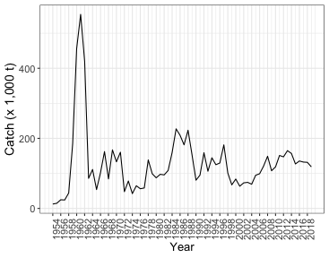

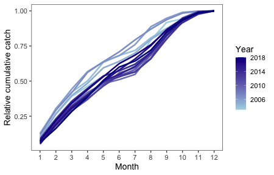
\
Figure 4.5: Yellowfin Sole annual total catch (1,000s t) in the Eastern Bering Sea from 1954-2019 (upper panel). Yellowfin Sole annual cumulative catch by month and year (non CDQ) 2003-2018 (lower panel).

\pagebreak

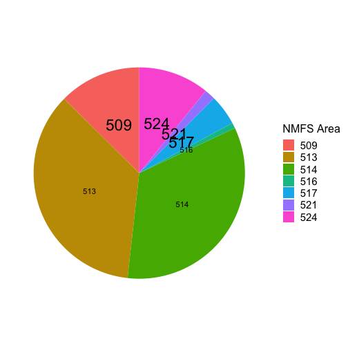

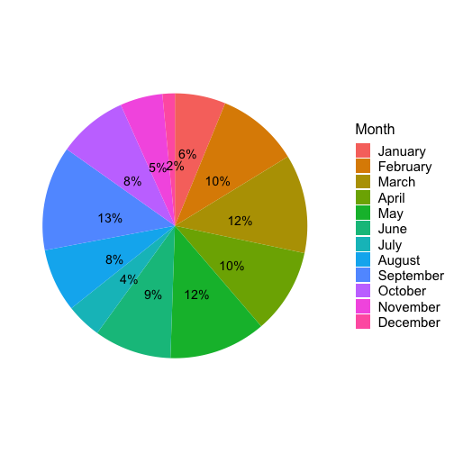
Figure 4.7: Yellowfin Sole catch proportion by area (upper panel) and by month (lower panel) in the Eastern Bering Sea in  2018 . 

\pagebreak

\pagebreak

Figure 4.6: Size composition of the yellowfin sole catch in 2019 (through mid-September), by subarea and total.

\pagebreak

Figure 4.8: Fishery locations by month, 2019

\pagebreak

\begin{center}
    \includegraphics[width=6.5in]{/Users/ingridspies/admbmodels/flatfish/assessments/yfs/doc/data/yfs_cpuediff_2019_arcmap.pdf}
\end{center}
Figure 4.11: Difference between the 1985-2016 average trawl survey CPUE for Yellowfin Sole and the 2019 survey CPUE.  Open circles indicate that the magnitude of the catch was greater in 2017 than the long-term average, closed circles indicate the catch was greater in the long-term average than in 2019.

\pagebreak

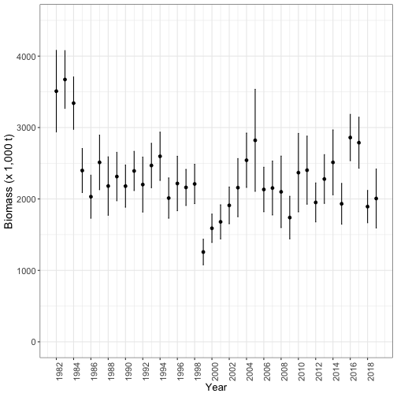
Figure 4.10: Annual eastern Bering Sea bottom trawl survey biomass point estimates and 95% confidence intervals for Yellowfin Sole, 1982-2019.
                                                     

\pagebreak

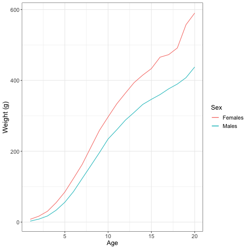
Figure 4.2: Average Yellowfin Sole weight-at-age (g) from trawl survey observations.

\pagebreak

\begin{center}
\includegraphics[width=5in,angle=270,origin=c]{/Users/ingridspies/admbmodels/flatfish/assessments/yfs/doc/data/Black_Fig3.pdf}
\end{center}
Figure 4.3: Master chronology for Yellowfin Sole and time series of mean summer bottom temperature and May sea surface temperature for the southeastern Bering Sea (Panel A).  All data were normalized to a mean of 0 and standard deviation of 1.  Correlations of chronologies with bottom temperature and sea surface temperature are shown in panels B and C, respectively (Matta et al. 2010).

\pagebreak

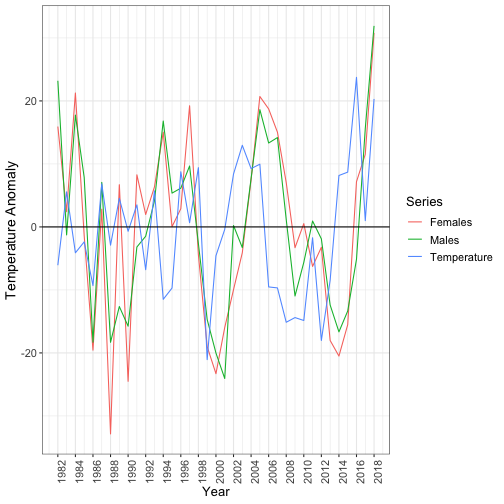
Figure 4.4: 

\pagebreak

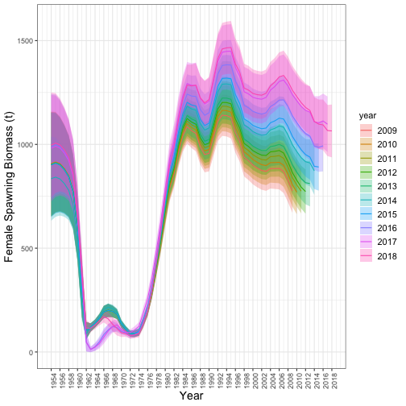
Figure 4.18: Retrospective plot of female spawning biomass. The preferred model with data through 2019 is shown, and data was sequentially removed through 2009.

\pagebreak

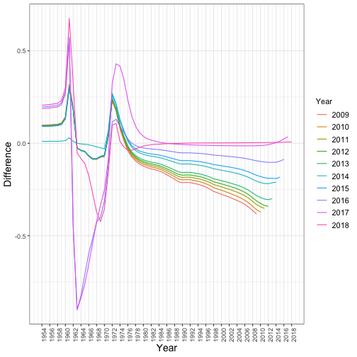
Figure 4.19: Relative differences in estimates of spawning biomass between the 2019 model and the retrospective model run for years 2018 through 2009.

\pagebreak

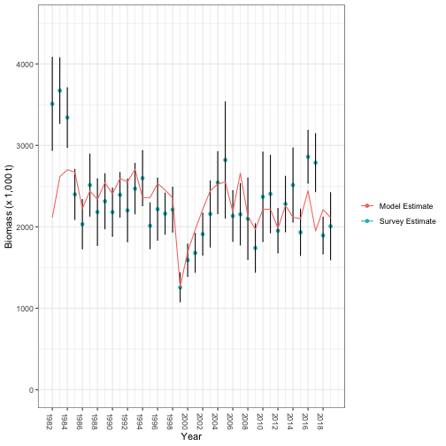
Figure 4.21: NMFS eastern Bering Sea survey biomass estimates, with 95% confidence intervals. The model fit to survey biomass estimates is shown as a red line. Data from 1982-2019.

\pagebreak
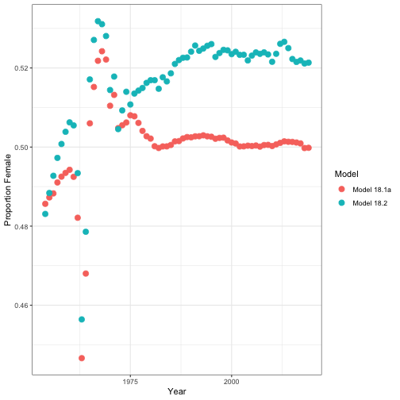
Figure 4.16: Model estimates of the proportion of female Yellowfin Sole in the population, 1982-2019.

\pagebreak
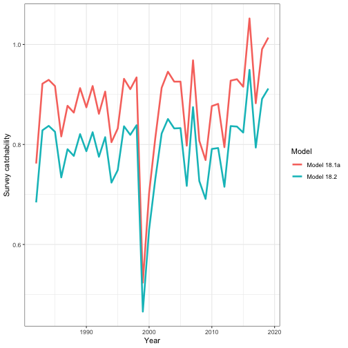
Figure 4.15: Survey catchability for Model 18.1a and 18.2, 1982-2019.

\pagebreak
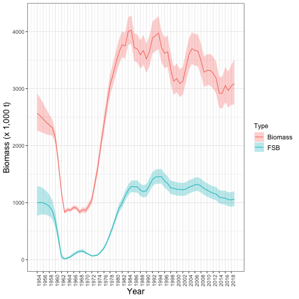
Figure 4.22: Model estimates of total (age 6+) and female spawning biomass with 95% confidence intervals, 1954-2019.

#survey selectivity
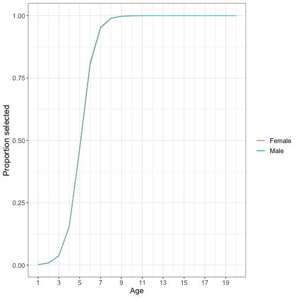
Figure 4.13: Estimate of survey selectivity for males and females.

\pagebreak
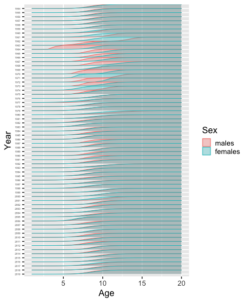

Figure 4.14: Estimate of fishery selectivity for males and females, 1954-2019.

\pagebreak

Figure 4.12: Ricker stock recruitment curve with 95% confidence intervals (shaded region) fit to female spawning biomass and recruitment data from 1978-2013. Years in black indicate data used to fit the model.

\pagebreak
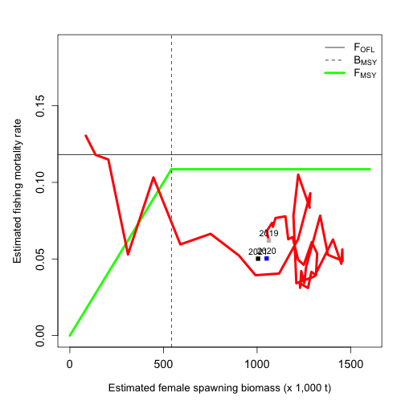

Figure 4.20: Fishing mortality rate and female spawning biomass from 1975 to 2019 compared to the F35% and F40% control rules.  Vertical lines are B35% and B40%.

\pagebreak

## Appendix

Table A1. Removals (kg) of Yellowfin Sole from the Bering Sea from sources other than those that are included in the Alaska Region’s official estimate of catch, 1990-2019. Source NMFS Alaska Region: Sourced by the AKR.V_NONCOMMERCIAL_FISHERY_CATCH table, October 31, 2019. Abbreviations: IPHC (International Pacific Halibut Commission), ADFG (Alaska Department of Fish and Gam), NMFS (National Marine Fisheries Service).

\begin{tabular}{lrrr}
\toprule
  & ADFG & IPHC & NMFS\\
\midrule
2006 & 0 & 0 & 1\\
2007 & 6 & 0 & 0\\
2010 & 38 & 1 & 118577\\
2011 & 87 & 0 & 100900\\
2012 & 13 & 0 & 83390\\
2013 & 24 & 9 & 75044\\
2014 & 2 & 0 & 82574\\
2015 & 10 & 66 & 64905\\
2016 & 61 & 15 & 97795\\
2017 & 38 & 1 & 112121\\
2018 & 55 & 1 & 72451\\
\bottomrule
\end{tabular}

